# C++高级程序设计

[TOC]

## 结构化程序设计部分

### 1. C++历史

#### 1.1 演化历程

- Father of Simula67、Father of OO programming
  - Ole-Johan Dahl、Kristen Nygaard
- C语言之父、共同发明UNIX
  - Dennis Ritchie、Ken Thompson
- 1980年形成C with class
  - Bjarne Stroustrup
- 1983年正式命名为C++
  - Rick Mascitti
- 1994年制定ANSI C++标准草案

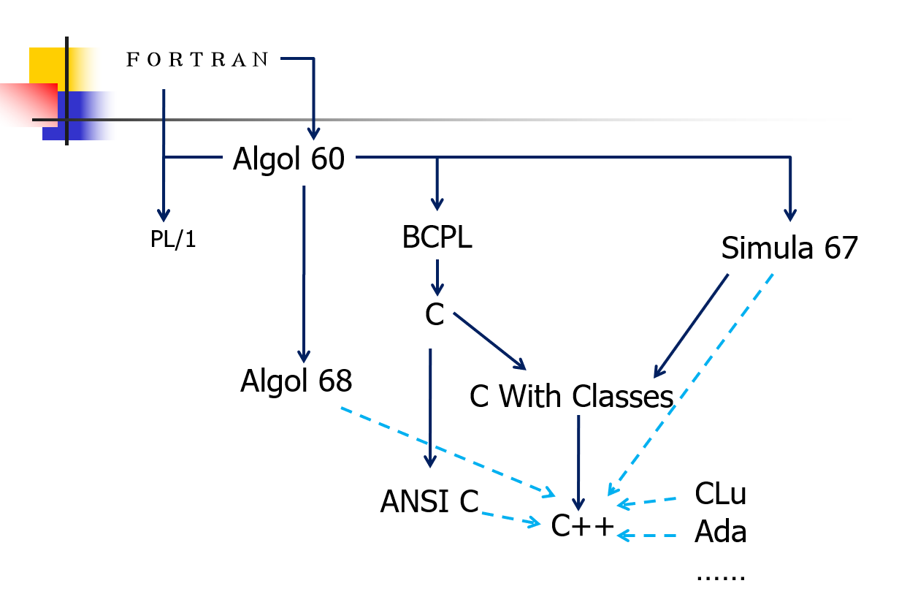

#### 1.2 设计理念

- 效率
- 实用性优于艺术性严谨性
- 相信程序员（允许一个有用的特征比防止各种错误使用更重要）

#### 1.3 C 与 C++ 的关系

- C++ 完全包含了 C 语言成分，支持 C 支持的全部编程技巧，C 是建立 C++ 的基础，同时 C++ 还添加了OOP的完全支持。
- 任何 C 程序都能被 C++ 用基本相同的方法编写，并具有相同的运行效率和空间。
- C++ 还引入了重载、内联函数、异常处理等功能，对 C 中过程化控制及其功能进行了扩充

#### 1.4 C和C++混合编程应该注意的问题

- 名变换：如果调用C语言库中的函数，则需要附加 `"extern C"`，限制 C++ 编译器进行名变换，便于可以连接

- 静态初始化：C++ 静态的类对象和定义在全局的、命名空间中的或文件体中的类对象的构造函数通常在 `main` 被执行前就被调用，尽可能把主函数写在 cpp 文件当中

- 内存动态分配：C++ 使用 `new/delete`，C 使用 `malloc/free`，需要注意匹配

- 数据结构兼容：将在两种语言间传递的东西限制在用 C 编译的数据结构的范围内，这些结构的 C++版本可以包含⾮虚成员函数，不能有虚函数。

- 因为C++是C的超集，且C是结构化编程语言，⽽C++支持面向对象编程语言，所以在混合编程时，不应当出现class等⾯向对象的关键字

- C语言不支持函数重载。

  > 在C++中f (int, int) 与 f(int, double) 是不同的函数，都重载了函数 f()；但是在C语言中却被认为是相同的函数。因为在编译时，*C语言给这几个函数的命名为 f；而C++命名分别为 f_int_int，f_int_double，f*，以表示区别；所以混合编程时应注意重载函数的问题

- 在 C++ 中也允许在 `struct` 和 `union` 中定义函数，他们也具有类的基本功能，与 `class` 所不同的是，`struct` 和 `union` 的成员的默认访问控制为 `public`

### 2. 基本语法

#### 2.1 Data

- 强类型，动/静结合

#### 2.2 基本数据类型

- Modifiers ：long、short、signed、unsigned
  - char 只能用signed、unsigned修饰
  - float 不能被修饰
  - double 只能用long修饰
  - int 可以用4种修饰符组合修饰
- 操作符 sizeof
- typedef 定义同义词

#### 2.3 表达式

- 赋值表达式
  - 左值＝右值表达式
    - 左值：可以出现在赋值表达式左部的表达式，具有存放数据的确定地址
    - 类型不同时，先计算右值表达式的值，再转换为左值类型，然后赋值

- 条件运算符表达式
  - \<exp1> ? \<exp2> : \<exp3>
  - 如果\<exp2> 和\<exp3>的值类型相同，且均为左值，则该条件运算符表达式为左值表达式
  - 可嵌套
    - sign(x)      x > 0? 1: x == 0? 0 : -1
    - 就近原则
  
- 逗号表达式

  - $<exp_1>,<exp_2>,…,<exp_n>$

  - $<exp_n>$的值作为该逗号表达式的值

    ```c++
    int a, b, c;
    int d = (a = 1, b = a+2, c = b+3);
    cout << d << endl; //6
    ```

  - 如$<exp_n>$为左值，则该逗号表达式为左值

- 影响表达式值的因素

  - 


#### 2.4 语句

- 表达式语句、IO语句和控制流语句
- switch
  - 整形常量表达式：`5、const、enum、define`(对于compiler是固定的)
  - 值不重复
  - 次序任意(特指case)
  - switch可以和enum结合使用，将具体数值解耦
  - switch的进一步优化可以使用表驱动


##### 2.4.1 switch的实现与优化(表驱动)

- 对于switch的汇编格式，其只需要被翻译为cmp一次即可。
- switch：使用表驱动来提高效率
- 详见PPT 36页的动画：不要将提示语进行硬编码，可以使用枚举类型(集中管理)
- 计算机中的所有的鼠标操作都会对应一个事件
- 字面常量调整为枚举类型，还可以使用事件表来完成
  - 使用一个handler
  - 表是从内存中装载进来
- 目前操作系统中的对应存储对应的文件为RC

##### 2.4.2 switch的实现与优化（编译过程）

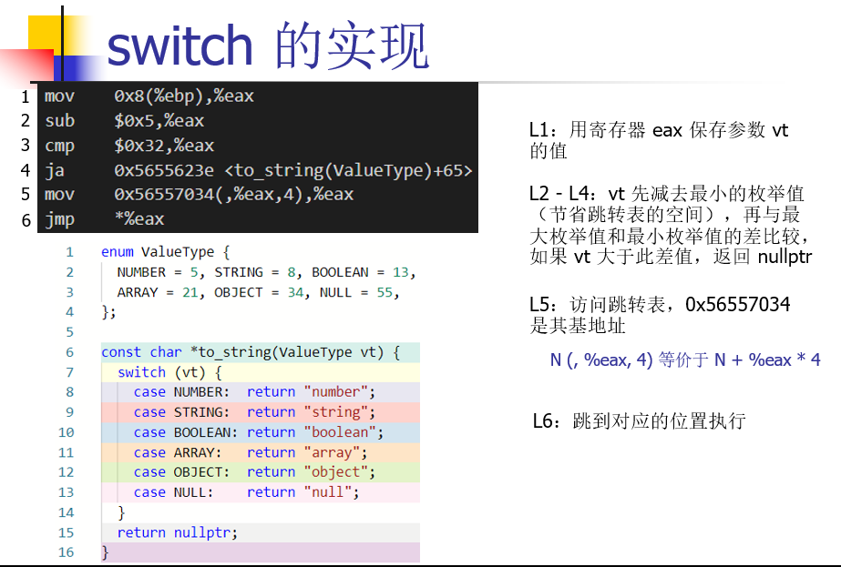

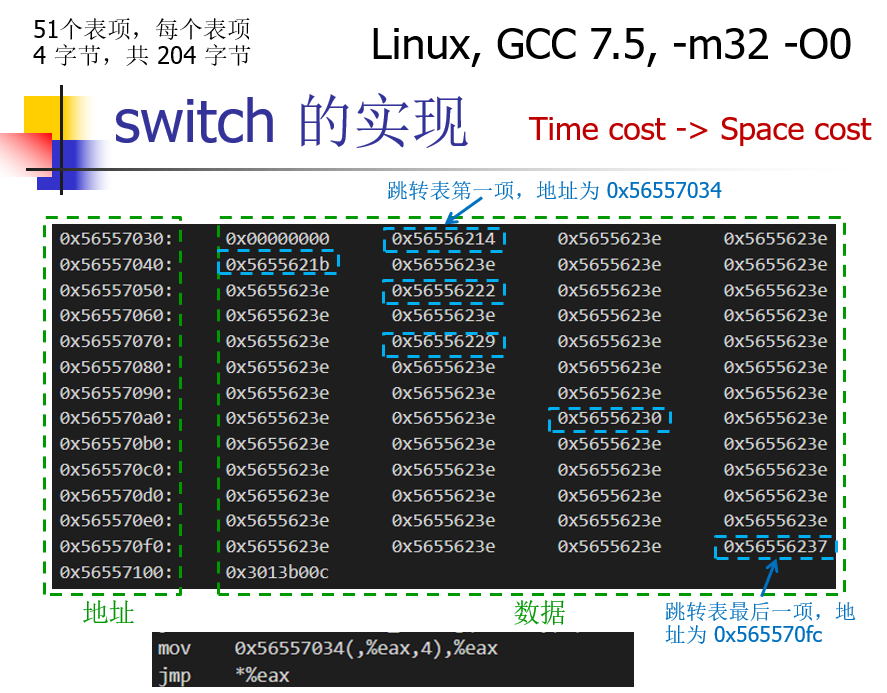

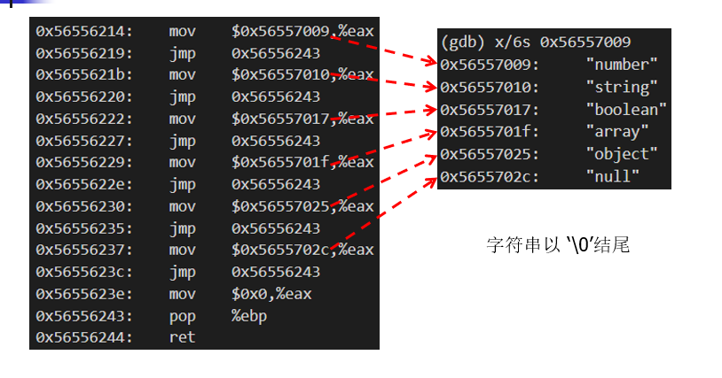

##### 2.4.3 如果range很大

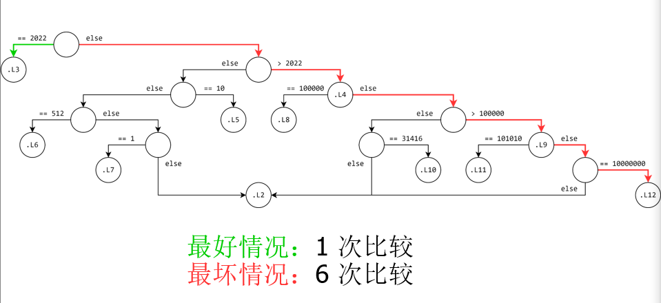

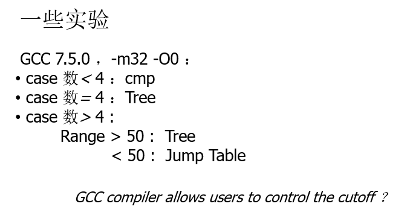

#### 2.5 表驱动

- Application Scene应用
  - Error/exception handle 异常处理
  - Message-driven 信息驱动
  - Function pointer 函数指针：就是例子中case里面只是简答的打印，而实际情况中可能只是相似的接口而已，这是我们就要使用到函数指针了。
- Implementation 实现
  - Array 数组
  - Map

### 3. 函数

- 原则
  - 定义不允许嵌套
  - 先定义后使用
- 函数的执行机制
  - 建立被调用函数的栈空间
  - 参数传递
    - 值传递 (call by value)
    - 引用传递 (call by reference)
  - 保存调用函数的运行状态
  - 将控制转交被调函数

#### 3.1 函数与内存

##### 3.1.1 存储空间与内存

- 从上到下分别是
  - Code：存放函数体的二进制代码
  - Data：存放数据(静态变量和全局变量和字符串常量)
  - Stack：由系统管理，存放函数参数值，局部变量
  - Heap：可以用程序员进行分配，可以在运行时动态确定，`int *p = (int *)malloc(4)`，归还内存`free`(在C++中不推荐使用这种方法进行处理，而是使用new和delete)

##### 3.1.2 Runtime Environment

- __cdecl

- __stdcall

- __fastcall

- __thiscall

#### 3.2 函数执行机制

##### 3.2.1 建立被调用函数栈空间

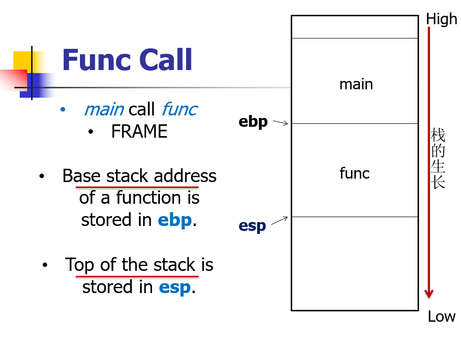

##### 3.2.2 参数传递

- 值传递

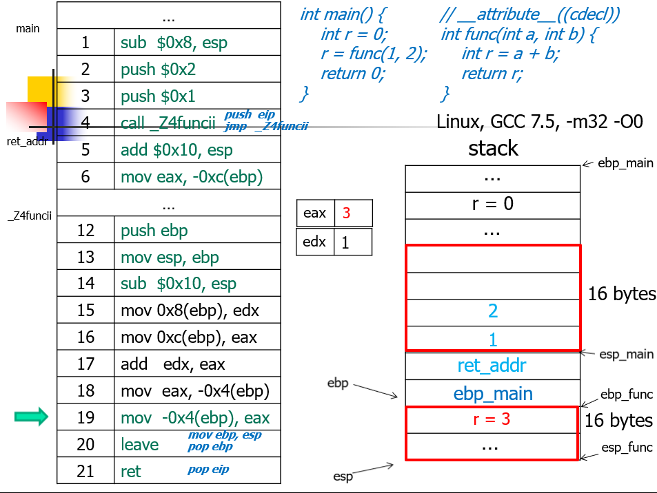

- 引用传递
  - 传递的是地址，会同时修改对应地址单元中的值。（函数副作用）

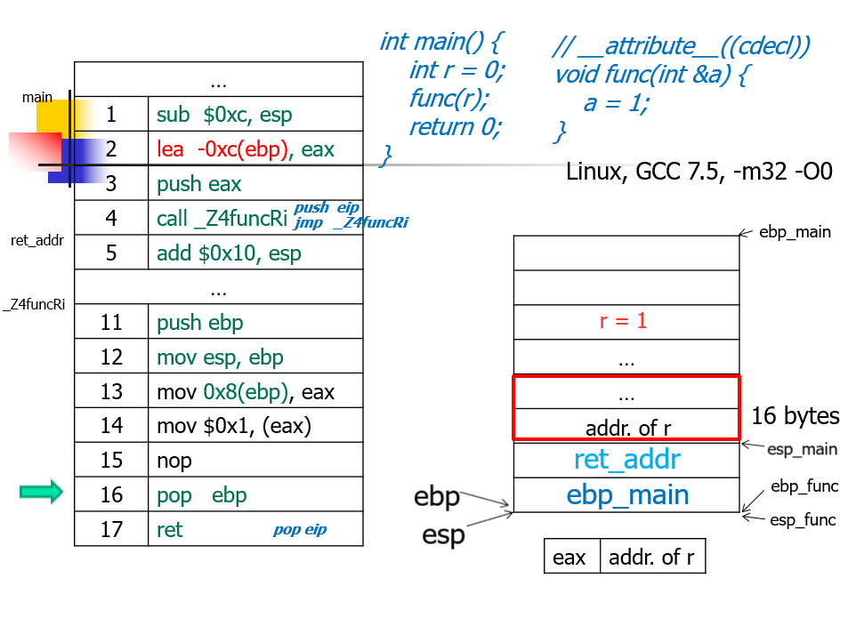

- call by name：是指在用到该参数的时候才会计算参数表达式的值
- call by value-result

##### 3.2.3 保存调用函数的运行状态(额外的Cost)

- 存储新的基指针：如上面，将ret_addr和main_esp进行存储。
- 分配函数存储的空间
- 执行某些功能
- 释放不必要的存储空间

##### 3.2.4 将控制转交给被调函数

- 加载调用者的基指针
- 记载返回地址

##### 3.2.5 Summary

- 加载参数(进栈)
- 保存上下文环境
  - 保存返回地址
  - 保存调用者基指针
- 执行函数
  - 设置新的基指针
  - 分配空间(可选)
  - 执行一些任务
  - 释放空间(如果分配了的话)
- 恢复上下文环境
  - 加载调用者基指针
  - 加载返回指针
- 继续执行调用者的功能

#### 3.3 函数原型

- 遵守先定义后使用原则

- 自由安排函数定义位置

- 语句:只需参数类型，无需参数名称

- 编译器检查

- 函数原型:只需要看到函数名和参数读取到即可:

  ```
  int func(int,int)
  ```

  - 在调用点一定要能看到接口
  - 仅仅需要函数名和参数类型即可

- 函数原型应当放置在头文件中

#### 3.4 函数重载

- 原则：
  - 名称相同，参数不同(重载函数的参数个数、参数类型、参数顺序至少一个不同)
  - 返回值类型不作为区别重载函数的依据

- 匹配原则

  - 严格匹配
  - 内部转换
  - 用户定义的转换

- 举例

  ```c++
  //下面这种是不被允许的，ambiguous
  void f(long);
  void f(double);            
  f(10);
  ```

#### 3.5 函数的默认参数

- 默认参数的声明
  - **函数原型中给出**
  - 先定义的函数中给出
  
- 默认参数的顺序
  - **右→左**
  
  ```c++
  void f(int a,int b = 2, int c = 2) //正确
  void f(int a,int b = 2, int c) //错误
  ```
  
  - 不间断
  
- 默认参数与函数重载要注意

  - `void f(int); void f(int, int=2);`，ambiguous

#### 3.6 外部函数 extern

- 符号表：Name mangling: extern "C"
  - 在C++的g中调用C中的f，会在link的时候出问题(因为不在C++ 的符号表中)
  - 解决方案:在函数名前面加上extern的关键词(这样子编译器就会在编译过程中从外部进行寻找)
- C编译器编译的文件被放置在lib库中，C++不能直接调用，而是需要extern才可以
- 原因：符号表机制
  - 符号表：与编译的各个阶段都有交互，存有函数名、地址等信息；编译时会创建一个函数符号表`<name,address>`，对应的符号后面的地址还没确定(link期决定)，call name根据name找到符号表对应的地址，再执行
  - 对于C语言来说，编译得到的符号表内函数f在符号表里的name就是f(不存在函数重载)
  - 对于C++来说，因为有重载，所以f(int)和f(float)在符号表里的name是不同的
  - C++对于C语言的函数 f 会按c++的方式生成函数表中的nameA，但 C 编译好的函数表内 f 对应的nameB和nameA不一致，导致C++无法找到该函数

#### 3.7 inline

- 内联函数inline
  - 目的
    - 提高可读性
    - 提高效率
  - 实现方法
    - 编译系统将为inline函数创建一段代码，在调用点，以相应的代码替换
  - 限制
    - 递归
    - 函数指针
  - **inline** 函数仅仅是一个对编译器的建议，所以最后能否真正内联，看编译器的意思，它如果认为函数不复杂，能在调用点展开，就会真正内联，并不是说声明了内联就会内联，声明内联只是一个建议而已。
  - 适用
    - 使用频率高、简单、小段代码

```c++
inline int ascii(char c) {
    return c;
}
int main(int argc, char *argv[]) {
    int r = 0;
    r = ascii('1');
    printf("r = %d\n", r);
    return 0;
}	
```

- 缺点：

  - 增大目标代码

  - 病态的换页

    > **如果有过长的代码，被替换进入代码的段中，代码页在内存和磁盘中反复换页抖动**(每调用一次内联函数就会将那段代码复制到主文件中，内存增加，内存调用时原本一页的内容可能出现在第一页+第二页的一部分，**造成操作系统的"抖动"**)

  - 降低指令快取装置的命中率(instruction cache hit rate)

### 4 程序组织

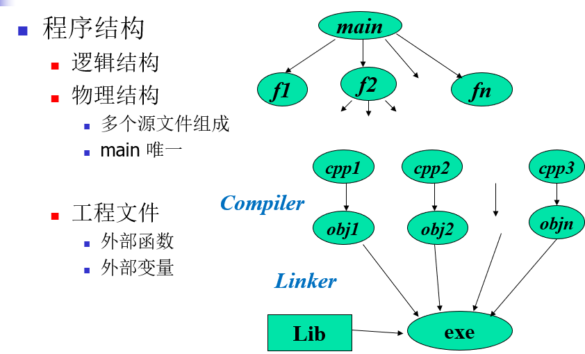

- 编译只编译当前模块

```c++
g(){  //a.cpp
	f()  //b.cpp
}
```

- 编译每个编译单元(`.cpp`)时是相互独立的，即每个cpp文件之间是不知道对方的存在的,`.cpp`编译成`.obj`后，link期时`a.obj`才会从`b.obj`中获得`f()`函数的信息
- link时将编译的结果连接成可执行代码，主要是确定各部分的地址,将编译结果中的**地址符号全换成实地址**(call指令在a.cpp被编译时只是call f的符号，而不知道f确切的地址)

#### 4.1 static

- 修饰全局变量时，表明一个全局变量只对定义在同一文件中的函数可见。
  + 其他文件中可以定义相同名字的变量
- 修饰局部变量时，表明该变量的值不会因为函数终止而丢失。
  + 该变量在全局数据区分配内存(局部变量在栈分配内存)
  + 始终驻留在全局数据区直到程序运行结束，但作用域为局部作用域，不能再函数外访问
- 修饰函数时，表明该函数只在同一文件中调用。
  + 其他文件中可以定义相同名字的函数
- 修饰类的数据成员，表明对该类所有对象这个数据成员都只有一个实例。即该实例归所有对象共有

#### 4.2 namespace

```c++
#include<iostream>
using namespace std;

namespace A
{
	int a = 0;
	namespace D
	{
		int b = 1;
	}
}
namespace B
{
	int a = 2;
	namespace C
	{
		int b = 4;
	}
}
int main() {
	using namespace B;
	using namespace C;
	cout << b；//必须using B,C否则b会报错
	getchar();
}
```

- using-declaration
  - 指定使用L中的哪些变量/函数 `using L::k`
- using-directive
  - 使用L中的全部内容 `using namespace L`

### 5. 数组

- 特征：
  - 相同类型
  - 连续存储

#### 5.1 一维数组

- 函数接口：void f(int a[]，int n)

  - 元素个数须通过参数**显式**给出，不能通过*sizeof*取得

    - 字符串特例：void f(char a[])

    - ```c++
      char s1[] = "abc";  //等价于2
      char s2[] = {'a', 'b', 'c', '\0'};
      char s2[] = {'a', 'b', 'c'};  //不正确
      ```

#### 5.2 二维数组

- 定义

  ```c++
  int B[2][6];
  typedef int T[6];
  T B[2];//等价于int B[2][6]
  int C[2][3][2];
  typedef int T2[2];
  typedef T2 T1[3];
  T1 C[2];//等价于int C[2][3][2]
  ```

- 参数传递

  - 缺省第一维

  ```c++
  void show(int a[], int n);
  void show(int a[][2], int n);
  void show(int a[][2][3], int n);
  ```

### 6. Struct

- 可以做赋值操作：同类型，大块数据的传输

  - struct按不同顺序排列sizeof()会不一样

  - ```c++
    struct A {
        char a;
        int b;
        short c;
    }
    cout << sizeof(A) << endl; //此时sizeof(A) = 12
    struct B {
        short c;
        char a;
        int b;
    }
    cout << sizeof(B) << endl;//此时sizeof(B) = 8，因为short占2个字节，四个字节并未占满，所以还可以填入一个char，但是再遇到int（4个字节）就不能再填充了，只能从写一个四字节地址开始，所以共占8个字节
    ```

### 7. Union

- 共享存储空间（公共的容器），能够节省空间，union变量占用的内存长度等于最长的成员的内存长度，所有成员的起始地址是一样的，故下面的&test.b &test.a &test.c是一样的

  - ```c++
    union B {
        char b;
        int a;
        short c;
    } test;
    cout << sizeof(B) << endl;//输出存储空间最大的一位，即输出max(sizeof(b), sizeof(a), sizeof(c))
    ```

- 应用

  - 矩阵

    - ```c++
      union Matrix {
          struct {
              double _a11, _a12, _a13;
              double _a21, _a22, _a23;
              double _a31, _a32, _a33;
          }
      }
      Matrix m;
      int i,j;
      for (i = 0; i < 3; i++)
          for (j = 0; j < 3; j++)
              m._element[i][j] = (i + 1) * (j + 1)
      ```

### 8. 指针

- **最基本的作用：管理地址信息**

  - 管理数据
  - 调用代码

- 定义

  - 格式：<基类型> *<指针变量> 例：int *p;

  - 使用typedef定义一个指针类型

    ```c++
    typedef int* pointer;
    pointer p, q;//p,q均是指针变量
    ```

- 操作符

  - &取地址，*间接取内容

    ```c++
    int x = 9;
    int *p;
    p = &x;
    *p = 1000;//p存储的是x的内容，*p间接获得x的内容
    //x的地址是0X5212，x的内容是9，p的地址是0X7B77，p的内容是x的地址0X5212，*p就是x的内容
    ```

  - NULL和nullptr区别，在C++中，NULL代表0，nullptr代表空指针

    ```c++
    #include<iostream>
    using namespace std;
    
    void func(int num) {
    	cout << "This is a NULL example" << endl;
    }
    void func(int *num) {
    	cout << "This is a nullptr example" << endl;
    }
    int main() {
    	func(NULL);
    	func(nullptr);
    }
    // 输出结果为
    // This is a NULL example
    // This is a nullptr example
    ```

- 指针运算

  - 赋值

    - 同类型赋值

  - +/- 整形

    - 结果类型不变

      ```c++
      int x; int *p;
      p = p + 1;
      p = &x + 2;
      p++; p--;
      ```

    - 数值：sizeof(基类型) * 整型数值

      ```c++
      int * p; double * q;
      p++;  //p的值加4
      q++;  //q的值加8
      ```

  - 同类型指针相减

    - 结果类型：整形

    - 数值：偏移量    

      - 值差/sizeof(基类型)

      ```c++
      int *p, *q, offset;
      int A[12];
      p = &A[0];
      q = &A[3];
      offset = q - p;//offfset = 3
      ```

- 同类型指针比较

  - ==、!=

- 输出

  ```c++
  int x = 1; int *p = &x;
  cout << p;  //x的地址
  cout << *p; //x的值
  
  //特例
  char *p = "ABCD";
  cout << p; 	 //p指向的字符串，ABCD
  cout << *p;  //p指向的字符，A
  cout << (int *)p //p的值，非char*
  ```

- void *

  - 只管理地址信息

  - 任何一种指针类型都能赋值给void *，void *是所有指针类型的公共接口

  - 任何操作都要做**强制类型转换**

    ```c++
    //将某块内存清零
    void memset(void *pointer, unsigned size) {
        char *p = (char *)pointer;
        for(int k = 0; k < size; k++) {
            *p++ = 0;
        }
    }     
    ```

- 常量指针

  - 一般形式 const <类型> * <指针变量>

    ```c++
    const int c = 0;
    const int *cp;
    int y = 1;
    int *q;
    cp =&c;		//√
    q = &y;		//√
    *cp = 1;	//×
    *q = 2;		//√
    cp = &y;	//√，用于消除函数副作用
    q = &c;		//×
    ```

  - 不能把一个有读写权力的指针赋值给只有读权力的地址

    - 不能用普通指针指向常量

  - const_cast可以取消常量属性

    ```c++
    const int c=128;
    int * q = const_cast<int *>(&c);
    *q = 111;
    cout << " c " << &c << c << endl;
    cout << " q " << &q << q << endl;
    cout << "*q " << q << *q << endl;
    //c      0012FF74    128  为什么？
    //q      0012FF70    0012FF74
    //*q     0012FF74    111
    ```

    - 编译器编译时已经把c换成字面常量128

- 指针常量

  - 一般形式 <类型> * const <指针变量> 必须在定义时初始化

  ```c++
  int x,y;
  int * const p = &x;
  p = &y;//错误
  *p = 1;
  ```

- 指针与数组
  
  - 数据升降维
  
  ```c++
  void(int A[],int n);//此时的A是一个指针常量
  void g(){
      int a[12];
      f(a,12);
      //此时的a已经转化为一个int *const表达式，失去了原来数组的含义
  }
  ```
  
  ```c++
  int a[12];
  int *p = &a[0];
  for(int i = 0;i < 12;i++){
      *(p++) = 0;
      *(a + i) = 0;
      *(a++) = 0;//该写法错误
  }
  ```

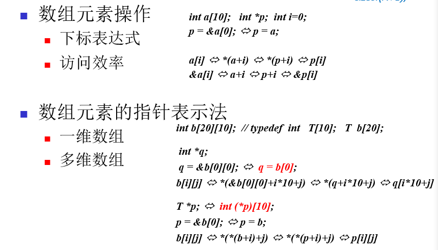

### 9. 动态变量

- 申请

  - new

  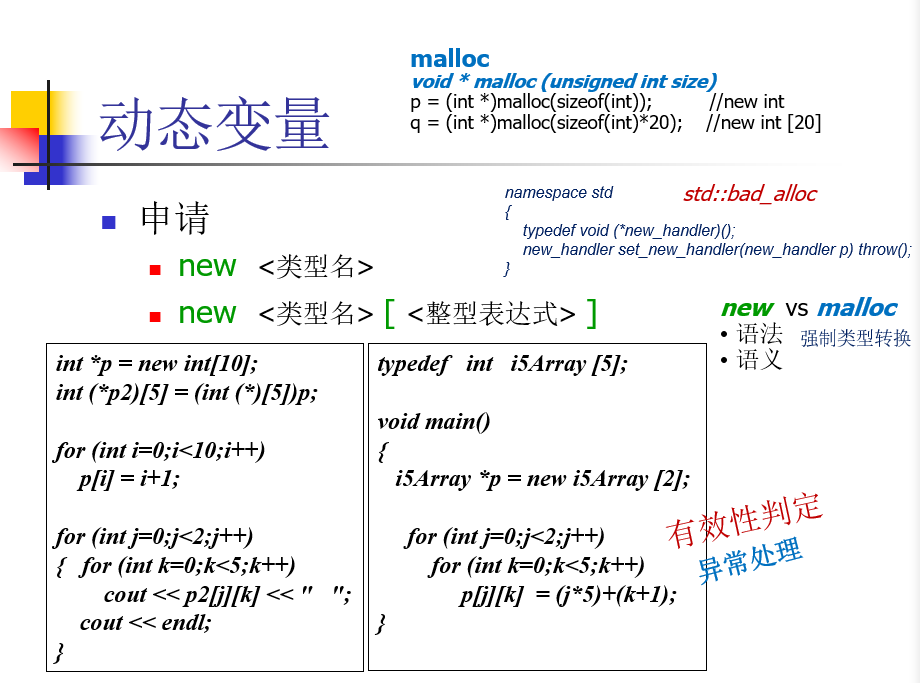

  - new vs malloc
    - 强制类型转换、构造函数

- 归还

  - delete
  - delete[]

### 10. 函数指针、泛型

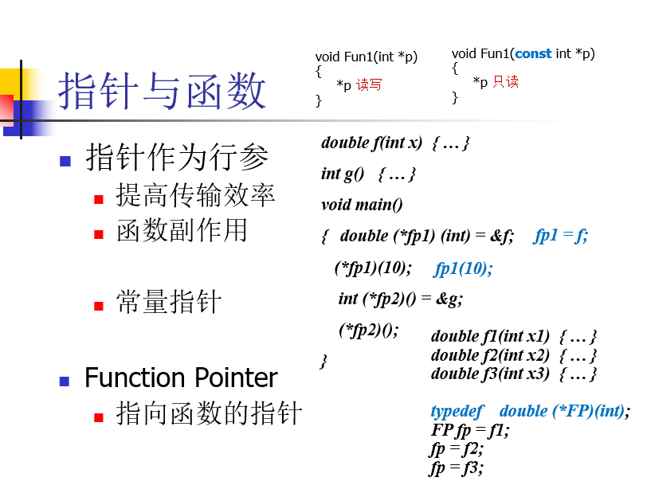

### 11. 引用

- 定义：**为一块已有的内存空间取一个别名**
  - 引用变量和被引用变量，必须是同类型
  - 引用变量定义中的&不是取地址操作符
  - 定义引用变量时，**必须初始化**
- 应用
  - 函数参数传递
  - 动态变量命名
- 函数返回值类型为引用
  - 注：**不能返回局部变量的引用**

## 面向对象部分

### 1. OOP

- Cfront编译之后（C++ --> C）还是变成和c一样的代码

```c++
bool Stack::push(int i)  -->  bool push(Stack * const this, int i)
```

### 2. 封装

- **类的定义和声明是分开的，类声明的头文件仅仅给出接口部分**

```c++
//类的声明 a.h
class TDate{
    public:
    	void SetDate(int y,int m,int d);
    	int IsLeapYear();
    private:
    	int year,month,day;
}
```

```c++
//类的定义 a.cpp
void TDate::SetDate(int y,int m,int d){
    year = y;
    month = m;
    day = d;
}
int TDate::IsLeapYear(){
    return (year%4 == 0 && year%100 != 0) || (year%400==0);
}
```

- 定义在类内部的函数是隐式的**inline**函数

#### 2.1 声明方法

```c++
TDate g; //保存在全局静态区，已经初始化好，g不是引用就是一个对象

int main() {
    g.SetDate(2000, 1, 1);
    
    TDate t;//保存在栈
    t.SetDate(2015, 11, 17);
    
    TDate *p = new TDate;//保存在堆
    p->SetDate(2015, 11, 17);
}
```

#### 2.2 构造函数

- 功能

  - 给创建的对象建立标识符
  - 为数据成员开辟内存空间
  - 根据规定进行初始化

- 默认构造函数不会对成员变量初始化

  - c++11规定，对于未指定默认初始化的堆、栈中的变量，是一个不确定的值，不会进行初始化。而全局变量，静态变量会被初始化为0

- 对象的**初始化**，构造函数可以被定义，也可以只声明

  ```c++
  class Line
  {
     public:
        void setLength( double len );
        double getLength( void );
        Line();  // 这是构造函数
   
     private:
        double length;
  };
   
  // 成员函数定义，包括构造函数
  Line::Line(void)
  {
      cout << "Object is being created" << endl;
  }
  void Line::setLength( double len )
  {
      length = len;
  }
  double Line::getLength( void )
  {
      return length;
  }
  // 程序的主函数
  int main( )
  {
     Line line;
     // 设置长度
     line.setLength(6.0); 
     cout << "Length of line : " << line.getLength() <<endl;
     return 0;
  }
  //输出结果为
  //Object is being create
  //6.0
  ```

- 描述

  - 与类同名，**无返回类型**，构造函数可以**有参数**，初始化要带参数，比如上面的Line类的构造函数可以改为Line(double  len)，构造函数的定义改为将length初始化为len

  - 自动调用，不可以直接调用

    ```c++
    class A{
        public:
        	A();
        	A(int i);
        	A(char *p);
    };
    A a1 = A(1);//等价于A a1(a) //等价于A a1=1;	自动调用A(int i);
    A a2 = A();//等价于A a2;	调用A(),不能写成A a2();
    A a3 = A("abcd");//等价于A a3("abcd") //等价于 A a3 = "abcd"	调用A (char *p)
    A a[4];//调用a[0],a[1],a[2],a[3]的A()
    A b[5] = {A(), A(1), A("abcd"), 2, "xyz" };
    ```

  - 可重载

  - 当类中没有提供构造函数时，编译系统自动提供

  - 一般声明为public，但也可以定义为private

#### 2.3 成员初始化表

  - 构造函数的补充

  - 先于构造体函数执行，**按类数据成员声明次序**，减轻compiler的负担

    ```c++
    class A
    {
        int    x;
        const  int   y;
        int& z;
        public:
        	A(): y(1),z(x), x(0)  {  x = 100; } //按照xyz顺序初始化
    };
    ```

  - 注意

    - 构造函数中尽量使用成员初始化表代替赋值动作
    - 数据成员太多时，不要使用，降低了可维护性
    
  - c++98只有static const成员可以在类内部直接初始化
    c++11允许非静态成员在声明处初始化

#### 2.4 析构函数

  - 结构：~类名()
  
  - 对象消亡时，系统自动调用，释放对象持有的非内存资源
  
  - 一般声明在public中，也可以声明在private中
  
  - 没有返回值，不接受参数（不能重载）
  
  - 声明为private：不能在栈上创建对象，只能通过new在堆上创建对象，通过实现一个public的方法来调用析构函数进行释放。
  
    ```c++
    class A {
      public:
        A();
        void destroy() {delete this;}
      private:
        ~A();
    };
    ```
  
    更好的方法
  
    ```c++
    static void free(A *p) {
        delete p;
    }
    A::free(P);
    ```
  
    优点：可以强制自主控制对象存储分配
    
  - 静态绑定，避免内存泄漏，基类析构函数需要声明为virtual

#### 2.5 拷贝构造函数

  - 创建对象时，用一同类的对象对其初始化

  - 自动调用

    ```c++
    //声明
    A a;
    A b = a; //等价于A b(a);
    //传参
    f(A a) {...}
    A b;
    f(b);
    //返回值
    A f() {
        A a;
        ...
        return a;
    }
    f();
    ```
    
  - 声明

  	public:
  		A(const A& a); //为什么要写引用: 如果不写，传参本身就要调用拷贝构造

  - 默认拷贝构造函数执行的是浅拷贝，一旦对象存在了动态成员，浅拷贝会出问题。此时要使用深拷贝
  
  - 参考网址： https://www.cnblogs.com/alantu2018/p/8459250.html 
  
  - 例
  
    ```c++
    class string{
        private:
        	char *p;
        public:
        	string(char *str){
                p=new char[strlen(str)+1];
                strcpy(p,str);
            }
        	~string(){
                delete[] p;
            }
    }
    void main1(){
        string s1("abcd");
        string s2=s1;
        //浅拷贝：s2和s1这两个指针指向堆里的同一空间，再销毁对象时，两个对象的析构函数将同一个内存空间释放两次，这就是错误所在
    }
    
    class string{
        private:
        	char *p;
        public:
        	string(char *str){
                p=new char[strlen(str)+1];
                strcpy(p,str);
            }
        	string(const string & c){
                p=new char[strlen(c.p)+1];
                strcpy(p,c.p);
            }
        	~string(){
                delete[] p;
            }
    }
    void main2(){
        string s1("abcd");
        string s2=s1;
        //深拷贝：s1和s2各自指向一段内存空间，他们指向的空间具有相同的内容
    }
    ```
    
  - **包含成员对象的类**
  
    - 调用默认拷贝构造函数
      - 调用成员对象的**拷贝构造函数**
    - 自定义拷贝构造函数
      - 调用成员对象的**默认构造函数**
      - 避免上面情况可以使用类似**成员初始化表**方式显式调用构造函数

#### 2.6 拷贝赋值函数

- 类似拷贝构造

- 声明

  ```c++
  A &operator=(const A & other_a) {}
  ```

#### 2.7 移动构造函数

- 引用

  ```c++
  int x = 5;
  int & y = x;
  //int & y = 5; 不允许，只能使用const引用
  const int & z = 5;
  const int & z = x;
  ```

- 右值引用（A&&）

  ```c++
  int num = 10;
  //int && a = num;不允许，右值引用不能初始化为左值
  int && a = 10;
  a = 100;//可以进行修改
  const int && a = 10;//编译器不会报错，支持定义常量右值引用
  ```

- 声明

  ```c++
  string::string (string && s) : p(s.p) {
      s.p = nullptr;
  }
  ```

- 例子

  ```c++
  string generate() {
      return string("test");
  }
  //string s = generate();
  string && s = generate();
  ```

- 编译器会合成默认的移动构造函数，**前提**：
  - 没有自定义**拷贝构造函数**，**拷贝赋值函数**
    - 移动构造目的是为了降低拷贝代价
    - 定义了拷贝构造说明有一种特定的拷贝行为，移动也会有一种特定行为
  - 没有自定义**析构函数**
    - 对申请的资源进行释放，自定义说明申请了额外的资源
    - 对于这部分资源编译器不知道如何拷贝，移动

#### 2.8 移动赋值函数

- 类似移动构造

- 声明

  ```c++
  A &operator=(A && a);
  ```

#### 2.9 拷贝构造和移动构造举例

```c++
http://c.biancheng.net/view/7847.html
```

### 3. 动态内存

#### 3.1 动态对象

- 在heap（堆）中创建
- new/delete
  - **使用new和delete可以自动调用constructor和destructor**

- new可重载
- malloc和free不调用构造函数和析构函数

```c++
A *p,*q;
p = new A;     
/*
1. 在程序的heap中申请一块大小为sizeof(A)的内存
2. 调用A的默认构造函数对该空间上的对象初始化
3. 返回创建的对象的地址并赋值给p
*/

q = new A(1);   
/*
1. ……	
2. 调用A的另一个构造函数 A::A(int)
3. ……
*/

delete  p; 	
/*
1. 调用p所指向的对象的析构函数
2. 释放对象空间
*/
delete q;	
```

-  对象删除

  ```c++
  delete intPtr;
  intPtr = nullptr;
  ```

#### 3.2 动态对象数组

- 创建与撤销

  ```c++
  A *p;
  p = new A[100];
  delete []p;
  
  int *q;
  q = new int[100];
  delete q;
  ```

- 注意

  - **不能显式初始化，相应的类必须有默认构造函数**

    - c++11引入统一初始化表

      ```c++
      class A{
          A(int i) {}
      };
      A * p = new A[5]{0, 1, 2, 3, 4}
      ```

  - delete中的**[]**不能省

    - 自定义对象数组前4个字节用来存储数组长度，因为要调用析构函数
    - 普通类型因为不调用析构函数，不用存储，可以直接delete，也可以delete[]

- 动态2D数组

  - 普通申请方式会有指针的额外内存开销

  - 可以使用一维数组申请，然后进行换算（**通过下标操作符的重载**）

    ```c++
    int * a = new int[12];
    a[i][j]  -->  a[i * 4 + j]
    ```

### 4. 特殊成员

#### 4.1 Const成员

- const成员变量

  - 初始化必须放在构造函数的**成员初始化表**中进行

  ```c++
  class A {
      	const int x;
      	static const int y = 100;//static const必须在声明的地方初始化
      public:
      	A(int c): x(c) {}
  };
  
  ```

- const成员函数

  ```c++
  //a.h
  class A{ 
          int x,y;
      public:
          A(int x1, int y1);
          void f();
          void show() const;
  };
  
  //a.cpp
  void A::f()
  {  x = 1; y = 1; }
  
  void A::show() const
  {  cout <<x << y;}
  
  //b.cpp
  const A a(0,0);
  //a.f(); 不允许
  a.show();
  ```

  - 如果把f()也标记为const，如何分辨呢

    ```c++
    void f( A * const this);
    void show(const A* const this);
    ```

  - **引用指向的值可以更改，因为引用本身没有改变**

    ```c++
    class A
    {
        int a;
        int & indirect_int;
    public:
         A():indirect_int(*new int){ ... }
        ~A() { delete &indirect_int; }
        void f() const { indirect_int++; }
    };
    ```

  - **mutable**关键字
    
    - 可以在const成员函数中修改被mutable修饰的变量

#### 4.2 静态成员

- 静态成员变量

    - 类对象所共享
    - 唯一拷贝
    - 遵循类访问控制
    - 不随对象创建而分配内存，也不随对象销毁而销毁，保存在全局静态区，程序结束才释放内存
    
- 静态成员变量必须在类声明的**外部初始化**

  ```c++
  class A{
    	int x, y;
    	static int shared;
  };
  int A::shared = 0;
  ```

- 静态成员函数

    - 静态成员函数只能访问**静态成员**（变量，函数）
    - 遵循类访问控制
    - 静态成员函数与普通成员函数的根本区别在于
        - 普通成员函数有 **this 指针**，可以**访问类中的任意成员**
        - 而静态成员函数**没有 this 指针**，只能访问静态成员（包括静态成员变量和静态成员函数）。 

- 静态成员的使用

    ```c++
    A a;
    a.f();//通过对象使用
        
    A::f();//通过类使用
    ```

- 静态成员函数常用于：控制对象创建
  - eg：单例模式

#### 4.3 友元

- 类外部不能访问该类的private成员
  - 通过public方法
    - 会降低对private成员的访问效率，缺乏灵活性

- 分类

  - 友元函数
  - 友元类
  - 友元类成员函数

  ```c++
  void func();
  class B;
  class C{
      void f();
  }
  class A{
      friend void func();     //友元函数,可以不提前声明
      friend class B;         //友元类
      friend void C::f();     //友元类成员函数
  }
  ```

- 特性

  - 友元不具有传递性

    - ```c++
      class Matrix{
          friend void multiply(Matrix &m, Vector &v, Vector &r);
      };
      class Vector{
          friend void multiply(Matrix &m, Vector &v, Vector &r);
      };
      //定义在两个类中的友元是单独针对Matrix或者Vector类的，两个不互通
      ```

  - 上述代码不能编译通过，需要进行**前置声明**

    ```c++
    class Vector;
    void multiply(Matrix &m, Vector &v, Vector &r);
    ...
    //函数必须使用引用，因为通过第一行不知道Vector有多大，如果不使用引用需要使用拷贝，所以会出错，而引用的大小是一致的
    ```

  - C++11之后可以访问private成员

  - 重点：**先声明后使用**

- 原则

  - 避免将数据成员放在公开接口中

  - 努力将接口完满且最小化

  - ```c++
    class AccessLevels {
    public:
       int getReadOnly const { return readOnly; }
       void setReadWrite(int value) { readWrite = value; }
       int getReadWrite() { return readWrite; }
       void setWriteOnly(int value) { writeOnly = value; }
    private:
       int noAccess;
       int readOnly;
       int readWrite;
       int writeOnly;
    };
    ```

- 作用

  - 提高程序设计的灵活性
  - 数据保护和对数据的存取效率之间的一个折中方案

### 5. 继承

- 继承机制
  - 基于目标代码的复用
  - 对事物进行分类
  - 增量开发

#### 5.1 单继承

- 单继承

  - protected

    - 派生类的**成员函数**可以访问基类的保护成员
    - 派生类/基类的**对象**都不能访问保护成员，在对象中相当于private

  - 子类无法继承父类的构造函数，友元函数，析构函数

  - ```c++
    class Student{       
      int id; 
      public:
        char nickname[16];
        void set_ID(int x)  { id = x; }
        void SetNickName(char* s) { strcpy(nickname,s);} 
        virtual void showInfo() 
        { cout << nickname << ":" << id <<endl; }
      	//virtual使得函数可以被动态重载
    };
    //父类的变量子类同样拥有，可以通过sizeof验证
    //子类中父类已经定义元素的访问权限与父类相同
    class Undergraduated_Student : public Student{      
      int dept_no; 
      public:
      	void setDeptNo(int x) { dept_np = x; }
      	void set_ID(int x){
          //函数重定义（静态的，并非动态）,但不是同一个名空间
        }
      	void showInfo(){
          cout << dept_no << ":" << nickname << ":" << id <<endl; 
        }
      private:
        using Student::nickname; //Undergraduated_Student的派生类不能再访问nickname，由于权限变成private
      	void SetNickName(); 
      	//编译器：1.找名字（可以调用则调用，否则不调用）；2.在子类中找到了SetNickName的名空间，就不会去父类找（名空间覆盖）；3.子类SetNickName名空间没有匹配char* s的函数，因此调用失败
    };
    ```

- 友元和protected

  - 友元不具有传递性
  - 派生类可以访问**基类**的保护成员，但不能访问**基类对象**的保护成员

- 基类构造函数的调用

  - 缺省执行基类默认构造函数

    ```c++
    class A{    
      int x;
      public:
         A() { x = 0; }
         A(int i) { x = i; }
    };
    
    class B: public A{   
    int y;
    public:
       B() { y = 0; }
       B(int i) { y = i; }
       B(int i, int j):A(i) 
       {   y = j;  }
    };
    
    B b1; 	    //执行A::A()和B::B()
    B b2(1); 	   //执行A::A()和B::B(int)
    B b3(0,1); //执行A::A(int)和B::B(int,int)
    ```

  - 没有指明基类如何拷贝且自定义派生类的拷贝构造函数，则会执行基类的默认构造函数
    如何指明调用基类拷贝构造函数

    ```c++
    B(const B & b) : A(b) {}
    ```

- 构造函数不能继承

  - 但如果派生类成员很少，基类很多会很麻烦
    解决方法（语法糖）：

    ``` c++
    class B : public A{
    	public:
    		using A::A //继承A的构造函数
    }
    ```

- 构造函数执行次序
  - 基类的构造函数
  - 派生类对象成员类的构造函数
  - 派生类的构造函数

#### 5.2 虚函数

- 类型相容

  - 对象切片

    ```c++
    class B:public A
    a = b;
    ```

    b的占用空间会比a大，执行a=b时会有信息丢失

    实现上：调用拷贝赋值函数（A的），不包含B的信息

- 前期绑定

  - 编译时刻
  - 依据对象的静态类型
  - 效率高、灵活性差

- 动态绑定

  - 运行时刻
  - 依据对象的实际类型
  - 灵活性高、效率差

- 限制

  - 类的成员函数才可以是虚函数
  - 静态成员函数不能是虚函数
  - 内联成员函数不能是虚函数
  - 构造函数不能是虚函数
  - 析构函数可以（往往）是虚函数

- 后期绑定的实现

  - 虚函数表

    ```c++
    A a; B b;
    A *p;
    (**((char *)p - 4))(p)
    //函数调用 (p) -- 参数, this
    (char *)p - 4 : 指向虚函数表的指针
    ```

- 声明

  ```c++
  class A{
      public:
      	virtual void f();
  }
  class B : public A{
      public:
      	void f();//基类中声明即可
  }
  ```

- **构造函数完成后才有虚函数表**，因此完成前virtual不生效，调用构造函数所属类的函数

- **final，override**

```c++
struct B {
    virtual void f1(int) const ;
    virtual void f2 ();
    void f3 () ;
    virtual void f5 (int) final;

};
struct D: B {
    void f1(int) const override ;//正确： f1与基类中的f1 匹配 
    void f2(int) override ;//错误： B没有形如f2(int) 的函数。int f2()？
    void f3 () override ;//错误： f3不是虚函数
    void f4 () override ;//错误： B没有名为f4的函数
    void f5 (int) ;//错误： B已经将f5声明成final
}
```

- 纯虚函数和抽象类
  - 纯虚函数
    - 声明时在函数原型后面加上**=0**
    - 往往只给出函数声明，不给出实现
    - 虚函数表中留位置但没有地址，直到派生类重写
  - 抽象类
    - 至少包含一个纯虚函数
    - 不能用于创建对象
    - 为派生类提供框架
  - 应用：抽象工厂模式
- 虚析构函数
- **绝对不要重新定义继承而来的缺省参数值**
  - **静态绑定**
- 访问控制是静态绑定：

  - 即使派生类将父类的public方法改为private，通过父类指针或引用依然可以调用

#### 5.3 多继承

- 基类的声明次序决定

  - 对基类构造函数/析构函数的调用次序
  - 对基类数据成员的存储安排

- 名冲突

  - <基类名>::<基类成员名>

- **虚继承、虚基类**

  - 问题：如果直接基类有公共的基类，则该公共基类中的成员变量再多继承的派生类中有多个副本

  - 解决：虚继承

    ```c++
    class A;
    class B: virtual public A;
    class C: public virtual A;
    class D: B, C;
    ```

    - 实现：创建虚基类，虚继承的派生类持有虚基类的指针

  - 虚基类的构造函数由最新派生出的类的构造函数调用（D构造A）

  - 虚基类的构造函数优先于非虚基类的构造函数执行

## 多态

- 一名多用：函数重载
- 类属：template
- OO程序设计：虚函数

### 1. 操作符重载

#### 1.1 一般操作符重载

- 歧义控制：

  - 顺序
  - 更好匹配（整型提升 eg. bool -> int）
- 不允许重载：

  - .     .*    ::    ?:
- 成员函数默认第一个参数为this
- 全局函数作为补充

```c++
//成员函数支持obj + 10,不支持10 + obj
class CL{
    int count;
public:
	friend CL operater+(int i, CL& a);    
    friend CL operater+(CL& a, int i);    
}
```

- 永远不要重载&&和||

  - 利用了短路机制，如果重载则两个表达式都会被计算，可能会出错

    ```c++
    if((p != 0) && (strlen(p) > 10))
    ```

- 有效率但不是过度有效率
  一些例子：
  +-*/一般使用拷贝即可，不需要引用

  ```c++
  const Rational & operator *(const Rational & r) const;
  
  - return Rational(n*r.n, d*r.d); //有&临时变量无法赋给引用，无&时在返回处创建对象不会发生拷贝
  
  - Rational *result = new Rational(n*r.n, d*r.d); //连乘会有内存泄漏
    return *result;
  
  - static Rational result; //不能同时利用 eg. if((a*b) == (c*d))
    result.n = n*r.n;
    result.d = d*r.d;
    return result;
  ```

- ++a与a++

  - ++a返回的是左值，可以继续调用函数

  - a++仅仅返回一个值

    ```c++
    class Counter{
      int value;
    public:
      Counter() {value = 0;}
      Counter& operator++() { // ++a
          value++;
          return *this;
      }
      Counter operator++(int) { // a++  //dummy argument哑元参数
          Counter temp = *this;
          value++;
          return temp;
      }
    };
    ```

#### 1.2 特殊操作符重载

##### 1.2.1 =

- 为了支持链式赋值，要返回同类型引用，即*this

- 返回类型是否要加const，不要加，否则：

  - 支持a=b=c
  - 不支持(a=b).f()

- A a = b; 调用拷贝构造函数

- A a，b；a=b；调用=操作符重载

- 赋值到一半失败了（例如分配内存时内存不够），且已经发生了更改

  - 先赋值后释放（还可以解决自我赋值问题）

    ```c++
    char *pOrig = p;
    p = new char[...];
    strcpy(...);
    delete[] pOrig;
    return *this;
    ```

##### 1.2.2 []

- 问题：对于 非常量 希望返回char &（更改），对于 常量 希望返回const char（不更改，只显示）

  ```c++
  char & operator [](int i); //string * const this
  const char operator [](int i) const;  //可以重载,const string * const this
  ```

- 多维数组

  - 使用wrapper
  
  ```c++
  class Array2D{ 
    public:
  	class Array1D{  
        public:
  		Array1D(int *p) { this->p = p; }
  		int& operator[](int index) { return p[index]; }
  		const int operator[] (int index) const { return p[index]; }
  	  private:
  		int *p;
  	};
      
  	Array2D(int n1, int n2) { p = new int[n1*n2]; num1 = n1; num2 = n2; }
      virtual ~Array2D() { delete [] p; }
      
  	Array1D operator[] (int index) { return p+index*num2; }
  	const Array1D operator[] (int index) const { return p+index*num2; }
      
    private:
  	int *p;
  	int num1, num2;
  };
  
  ```
##### 1.2.3 ()

- 函数调用

  ```c++
  double operator() (double, int, int);
  
  Func f;
  f(2.4, 0, 8);
  ```

- 类型转换

  ```c++
  operator double() {return (double) n / d;}
  ```

  - 若A -> B
    - B中构造函数有B(A)，同时A中定义了operator B()，会出错
    
##### 1.2.4 ->

  - 无法确定参数类型
    - 重载时按一元操作符重载描述，返回指针类型、其他定义了->重载的对象

  - 智能指针
    - 程序运行时可能有多个出口，内存管理比较困难，可以使用一个封装类封装要使用的指针，在栈上创建
    - 局限性：堆上创建的资源也要符合compiler控制的生命周期
    
    ```c++
    template <class T>
    class SmartPointer{
    public:
        SmartPointer(T *p=0) :ptr(p) {}
        ~SmartPointer() {delete ptr;}
        T* operator->() const { return ptr; }
        T& operator *() const { return *ptr; } 
    private:
        T* ptr;
    }
    ```
##### 1.2.5 new、delete

- new的过程

  - 分配内存（只能重载这一步）
  - 调用构造函数
  - 返回对象指针

- delete的过程

  - 调用析构函数
  - 确定指向分配空间的指针
  - 释放内存（可重载）

- new、delete为静态成员，在对象创建之前，析构函数之后

  - 隐式静态，不需要显式声明（声明也没事）

- 全局函数（所有内存分配）、成员函数（只对重载过的类有效，**推荐**）

- 可继承

- new和new[]

  ```c++
  void *operator new (size_t size, ...);
  void *operator new[] (size_t size, ...);
  //这两个是不同的、如果没有重载new[]，创建数组时依然使用全局默认的
  //系统自动计算对象大小,并传值给size
  ```

- delete

  ```c++
  void operator delete(void *p, size_t size);
  //p:被撤销对象的地址
  //第二个参数是被撤销对象的大小,可有可无
  ```

- 用途：内存池

### 2. 模板template

#### 2.1 模板

- 源代码复用机制
  - 编译时代码实例化（eg. 将T换为int），根据类型不同**复制**为很多个版本
  - 已经有的版本直接调用即可
- 实例化
  - 函数模板
    - 隐式实现
    - 根据具体模板函数调用

  - 类模板
    - 创建对象时显式指定


- 模板的完整定义通常出现在头文件中

#### 2.2 函数模板（类属函数）

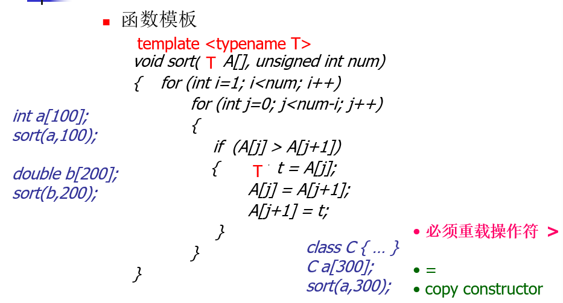

- 隐式实例化：编译器会自动推导类型

- 使用自定义类型时，函数重载和函数模板同时使用

- 函数模板的参数

  - 可带多个类型参数，用逗号分隔

  - 可带普通参数

    - 必须列在类型参数之后

    - 调用时需显式实例化

      ```c++
      template<class T, int size>
      void f(T t) {
          T temp[size];
      }
      
      f<int, 10>(5);
      ```

  - 默认参数：

    - 顺序可以任意，最好从右向左（与类模板一致）

    ```c++
    template<typename T, typename U = double>
    void test(T t = 0, U u = 0) {
        cout << "t=" << t << "u=" << u << endl;
    }
    
    int main() {
        test(4, 'a');			//调用test<int, char>(4, 'a')
        test(4);				//调用test<int double>(4, 0)
        test(); 				//编译失败，没有指明T的类型
        test<int>();			//调用test<int, double>(0, 0)
        test<int, char>();		//调用test<int, char>(0, 0)
    }
    ```

- 函数模板与函数重载配合使用
  - 函数重载优先于函数模板

#### 2.3 类属类

- 类定义带有类型参数

```c++
template<class T>
class Stack{}
```

- 需要显式实例化

```c++
Stack<int> st1;
Stack<double> st2;
```

- 类模板的静态成员属于实例化后的类

### 3. 异常处理

- 异常特征
  - 可以预见
  - 无法避免

- throw
  - 调用拷贝构造函数
  - 可以抛出指针，但不能指向局部变量
- catch
  - 精确匹配
  - 允许派生类到基类的转换
  - 自定义类使用引用，避免拷贝

```c++
class Base{};
class Derived: public Base{};

void f(Base & e) {
    //调用拷贝构造函数，发生对象切片
    throw e;
}
int main() {
    Derived e;
    try{
        f(e);
    }catch(Derived & e) {
        cout << "Derived";
    }catch(Base & e) {
        cout << "Base";
    }
    
    //输出Base
}
```

- 构造函数出现异常

  - 不能自己处理，要在try中new

  - 初始化列表异常，不属于构造函数

    - 最好的方法，不在初始化列表new对象

    - ```c++
      A()try{:...}
      ```

- 析构函数出现异常

  - 内部处理即可
  
- 特例

  - 无参数throw
  
    - 将捕获到的异常对象重新抛出
  
      ```c++
      catch(int) { throw; }
      ```
  
  - catch(...)
  
    - 默认异常处理
  
## 复习
### 1. c++为我们默认添加了哪些函数

  ```c++
  class Empty {}; 
  class Empty { 
      Empty();
      Empty(const Empty&);
      ~Empty();
      Empty& operator=(const Empty&);
      Empty *operator &();//取地址操作符重载
      const Empty *operator &() const;//常成员情况 const Empty e; 防止常成员通过指针被修改
  };
  ```

### 2. c++没有finally

- 理念：RAII，资源应该能做到自清理
- RAII：资源的获取过程就是对象的初始化过程
- 可以使用智能指针
- 将指针内容转移到另一个智能指针实现所有权转移

### 3. 遇到不能虚化的函数，但需要虚化

- 非虚接口

- 先构造一个可以虚化的函数，然后将不能虚化的包装起来
  - 全局函数
  
    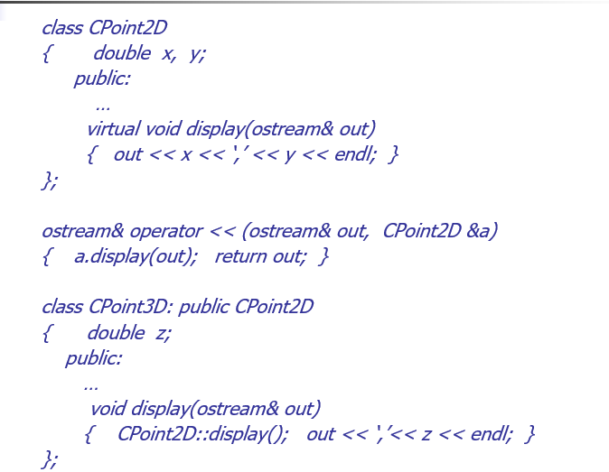
  
  - 构造函数

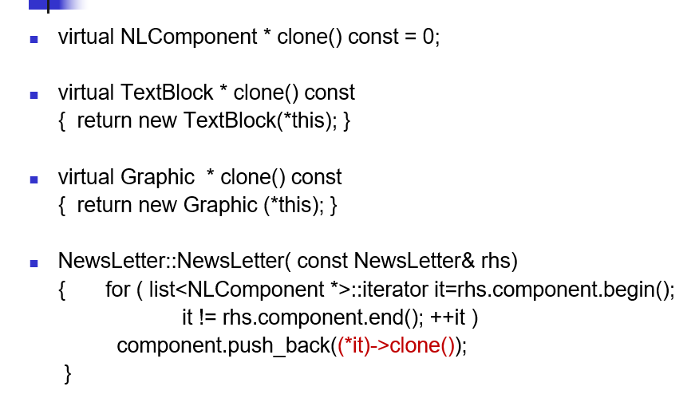


### 4. 智能指针

```c++
template <class T>
class SmartPointer{
public:
    SmartPointer(T *p=0) :ptr(p) {}
    ~SmartPointer() {delete ptr;}
    T* operator->() const { return ptr; }
    T& operator *() const { return *ptr; } 
private:
    T* ptr;
}
```

### 5. 永远不要多态地对待数组

```c++
class BST { … };
class BalancedBST: public BST { … };

void printBSTArray(ostream& s, const BST array[], int numElements)
{  for (int i=0; i < numElements; i++)  s << array[i]; }  //有问题,遍历的时候子类和父类偏移的大小是不一致的

BalancedBST bBSTArray[10];
…
printBSTArray(cout, bBSTArray, 10);
```

