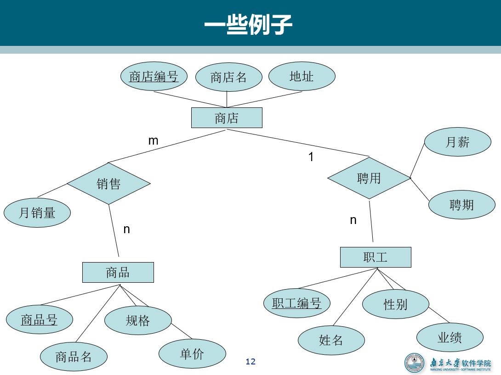

# 数据管理基础重点

- 题型
  - 选择 30
  - 简答 40
  - 综合 30

[TOC]

## 01-绪论

### 1. 数据管理方式


- 为什么需要数据库/数据有哪些管理方式，各自特点是什么

### 2. 几个基本概念

- 数据：数据库中存储的基本对象，是描述事物的符号记录。
- **数据的含义称为语义**，数据与其语义是不可分的。
  - 93是数据，它可以是成绩、体重、钱数，这些是语义
- **数据库是长期储存在计算机内、有组织的、可共享的大量数据的集合。**
- 数据库系统的构成：数据库、数据库管理系统（DBMS，及其应用开发工具），应用程序，数据库管理员（DBA）。

### 3. 数据模型

- 概念模型、逻辑模型、物理模型
- **（必考）**考点：概念 --> E-R图 --> 关系

#### 3.1 概念模型

- 用于数据库设计， 用 E-R 图来描述现实世界的概念模型。
- 概念：实体、属性、码、实体型、实体集、联系。



#### 3.2 逻辑模型

> 问题：如何“多快好省”地将信息世界转换为机器世界？
>
> 方案 1：尽量独立于应用层，采用“中立”的方式表达概念模型，体现为**关系数据库**
>
> 方案 2：在应用层中，使用特定数据结构，并在逻辑模型中高效支持这一数据结构，体现为 NoSQL 数据库
>
> 方案*：通用数据结构采用方案 1，关键性数据结构采用方案2

##### 3.2.1 关系模型的数据结构


- 规范条件：关系必须是规范化的，满足一定的规范条件。
- 最基本的规范条件（1NF）：关系的每一个分量必须是一个**不可分**的数据项，**不允许表中还有表**。
- 关系的完整性约束条件：**实体完整性、参照完整性、用户定义的完整性**。

##### 3.2.2 关系模型的优缺点


##### 3.2.3 NoSQL

- 基于Key-Value存储模型
- BigTable 模型：`(row:string, column:string, time:int64) ==> string`
- 基于文档模型
- 基于图模型：记为 G(V,E)，V 为结点集合，每个结点具有若干属性，E 为边集合，也可以具有若干属性。

### 4. 数据库系统的结构


#### 4.1 模式（逻辑模式）

- 一个数据库只有一个模式
- 模式的地位：是数据库系统模式结构的中间层
  - 与数据的物理存储细节和硬件环境无关
  - 与具体的应用程序、开发工具及高级程序设计语言无关
- 模式的定义
  - 数据的逻辑结构（数据项的名字、类型、取值范围等）
  - 数据之间的联系
  - 数据有关的安全性、完整性要求

#### 4.2 外模式（用户模式、子模式）

- 数据库用户（包括应用程序员和最终用户）使用的局部数据的逻辑结构和特征的描述
- 数据库用户的数据视图，是与某一应用有关的数据的逻辑表示
- 外模式的用途
  - 保证数据库安全性的一个有力措施
  - 每个用户只能看见和访问所对应的外模式中的数据

#### 4.3 内模式（存储模式）

- 是数据物理结构和存储方式的描述
- 是数据在数据库内部的表示方式
- 一个数据库只有一个内模式

#### 4.4 外模式/模式映像

- 同一个模式可以有任意多个外模式 
- 每一个外模式，数据库系统都有一个外模式／模式映象，定义外模式与模式之间的对应关系
- 保证数据的逻辑独立性
  - 当模式改变时，数据库管理员对外模式／模式映象作相应改变，使外模式保持不变
  - 应用程序是依据数据的外模式编写的，应用程序不必修改，保证了数据与程序的逻辑独立性，简称数据的逻辑独立性

#### 4.5 模式/内模式映像

- 模式／内模式映象定义了数据全局逻辑结构与存储结构之间的对应关系。
  - 例如，说明逻辑记录和字段在内部是如何表示的
- 数据库中模式／内模式映象是唯一的
- 保证数据的物理独立性
  - 当数据库的存储结构改变了（例如选用了另一种存储结构），数据库管理员修改模式／内模式映象，使模式保持不变。
  - 应用程序不受影响。保证了数据与程序的物理独立性，简称数据的物理独立性。

### 5. 数据库系统的组成


## 02-关系型数据库

- 域（D）、笛卡尔积(D*D)、元组((d1,d2,d3))、关系、属性、码，要了解是什么，符号

- **候选码**：若关系中的某一属性组的值能唯一地标识一个元组，则称该属性组为**候选码**。

- **主码**：若一个关系有多个候选码，则选定其中一个为**主码**。

  **主属性与非主属性**：**候选码的诸属性称为主属性**。不包含在任何侯选码中的属性称为**非主属性或非码属性**。

### 1. 数据库完整性

- 实体完整性：主属性不为空

- 参照完整性：外码为空或者等于相应的某个主码

- 用户定义完整性：

  例：课程（课程号，课程名，学分）

  ​		“课程名”属性必须取唯一值

  ​		非主属性“课程名”也不能取空值

  ​		“学分”属性只能取值{1，2，3，4}

### 2. 关系代数

- **基本操作：选择、投影、并、差、（广义）笛卡尔积、除**

- 悬浮元组、外连接

## 03-关系数据库标准语言SQL

- SQL 结构化查询语言，是关系数据库的标准语言。集数据定义语言（DDL），数据操纵语言（DML），数据控制语言（DCL）功能于一体。
- 仅有 9 个动词：`CREATE, DROP, ALTER, SELECT, INSERT, UPDATE, DELETE, GRANT, REVOKE`

### 1. SQL数据定义

#### 1.1 层次化的数据库对象命名机制

- 一个关系数据库管理系统的实例（Instance）中可以建立多个数据库（database）
- 一个数据库中可以建立多个模式（schema）
- 一个模式下通常包括多个表（table）、视图（view）和索引（index）等数据库对象


#### 1.2 删除

- RESTRICT：删除表是有限制的。

  - 欲删除的基本表不能被其他表的约束所引用

  - 如果存在依赖该表的对象，则此表不能被删除

- CASCADE：删除该表没有限制。

  - 在删除基本表的同时，相关的依赖对象一起删除

#### 1.3 数据字典

- 数据字典是关系数据库管理系统内部的一组系统表，它记录了数据库中所有定义信息：
  - 关系模式定义
  - 视图定义
  - 索引定义
  - 完整性约束定义
  - 各类用户对数据库的操作权限
  - 统计信息等

- 关系数据库管理系统在执行SQL的数据定义语句时，实际上就是在更新数据字典表中的相应信息。

### 2. SQL数据查询

#### 2.1 单表查询

```sql
SELECT [ALL | DISTINCT] <目标列表达式> [,<目标列表达式>] ...
	FROM <tableName> [,<tableName>] ... | (<select_caluse>)
	[AS] <alias>
	[WHERE <conditional_expression>]
	[GROUP BY <colName> [HAVING <conditional_expression>]]
	[ORDER BY <colName>] [ASC | DESC]];
	
/* HAVING短语与WHERE子句的 区别：
	作用对象不同
	WHERE子句作用于基表或视图，从中选择满足条件的元组
	HAVING短语作用于组，从中选择满足条件的组。*/
SELECT Sno FROM SC
GROUP BY Sno
HAVING COUNT(*) > 3;

SELECT Sno, AVG(Grade) FROM SC 
GROUP BY Sno
HAVING AVG(Grade) >= 90;
```


#### 2.2 连接查询

```sql
/* [例 3.49] 查询每个学生及其选修课程的情况 */
SELECT Student.*, SC.* FROM Student, SC
WHERE Student.Sno = SC.Sno;

/* 对上例使用自然连接 */
SELECT Student.Sno,Sname,Ssex,Sage,Sd ept,Cno,Grade FROM Student,SC
WHERE Student.Sno = SC.Sno;

/* [例 3.53] 改写 [例 3.49] 
	左外连接：列出左表中所有的元组 */
SELECT Student.Sno, Sname, Ssex, Sage, Sdept, Cno, Grade
FROM Student
LEFT OUT JOIN SC ON (Student.Sno=SC.Sno);

/* [例3.54]查询每个学生的学号、姓名、选修 的课程名及成绩 */
SELECT Student.Sno, Sname, Cname, Grade
FROM Student, SC, Course /*多表连接*/
WHERE Student.Sno = SC.Sno
AND SC.Cno = Course.Cno;
```

#### 2.3 嵌套查询（不做要求）

#### 2.4 集合查询

```sql
# [例 3.64] 查询计算机科学系的学生及年龄不大于19岁的学生。
SELECT *
FROM Student
WHERE Sdept = 'CS'
UNION
SELECT *
FROM Student
WHERE Sage <= 19;

# [例3.66] 查询计算机科学系的学生与年龄不大于19岁的学生的交集。
SELECT *
FROM Student
WHERE Sdept = 'CS' 
INTERSECT
SELECT *
FROM Student
WHERE Sage <= 19;
```

### 3. 数据更新（看看）

```sql
INSERT INTO <表名> [(<属性列1>[, <属性列2 >...)]
VALUES (<常量1> [, <常量2>]... );
                        
UPDATE <表名>
SET <列名>=<表达式>[, <列名>=<表达式>].
[WHERE <条件>];
                   
DELETE
FROM <表名> [WHERE <条件>];
```

### 4. SQL中的空值

- 判断空值用 `IS NULL` 或 `IS NOT NULL`。
- 有 `NOT NULL` 、 `UNIQUE` 限制的属性不能为空值，码不能为空值。
- 空值与其他值的算术运算结果为空值，空值与其他值的比较运算结果为 `UNKNOWN`。


```sql
# [例 3.83] 选出选修1号课程的不及格的学生以及缺考的学生。
SELECT Sno
FROM SC
WHERE Grade < 60
  AND Cno = '1'
UNION
SELECT Sno
FROM SC
WHERE Grade IS NULL
  AND Cno = '1';

# 或者
SELECT Sno
FROM SC
WHERE Cno = '1'
  AND (Grade < 60 OR Grade IS NULL);
```

### 5. 视图

- 有一个或几个基本表导出的表，是一个虚表。数据库中只存放视图的定义，不存放视图对应的数据。

- **视图的作用：**
  1. 视图能够简化用户的操作
  2. 使用户能够以多种角度看待同一数据
  3. 提供了一定程度的逻辑独立性
  4. 提供安全保护
  5. 可以更清晰地表达查询

#### 5.1 定义视图

```sql
CREATE VIEW <视图名> [(<列名> [,<列名>]...)]
AS <子查询> [WITH CHECK OPTION];
# WITH CKECK OPTION 表示对视图进行更新操作时要保证更新后的行满足谓词条件（即子查询中的条件）
```

#### 5.2 更新视图

- 允许对行列子集视图进行更新
- 对其他类型视图的更新不同系统有不同限制。
  - 一些视图是不可更新的，因为对这些视图的更新不能唯一地有意义地转换成对相应基本表的更新。
  - 一个不允许更新的视图上定义的视图也不允许更新。

## 04-数据库安全性

### 1. 自主存取控制

- 自主存取控制，简称**DAC**

- **缺点：可能存在数据的无意泄露**
  - 原因：这种机制仅仅通过对数据的存取权限来进行安全控制，而数据本身并无安全性标记
  - 解决：对系统控制下的所有主客体实施强制存取控制策略

#### 1.1 GRANT


```SQL
GRANT <权限>[,<权限>]... 
ON <对象类型> <对象名>[,<对象类型> <对象名>]...
TO <用户>[,<用户>]...
[WITH GRANT OPTION ];
# WITH GRANT OPTION 子句：可以再授予其他用户，不允许循环授权

# [例4.1] 把查询 Student 表权限授给用户 U1
GRANT SELECT
ON TABLE Student
TO U1;

# [例4.2] 把对Student表和Course表的全部权限授予所有用户
GRANT ALL PRIVILIGES 
ON TABLE Student,Course
TO PUBLIC;
```

#### 1.2 REVOKE

```sql
# REVOKE语句的一般格式为：
REVOKE <权限>[,<权限>]... 
ON <对象类型> <对象名>[,<对象类型><对象名>]...
FROM <用户>[,<用户>]...
[CASCADE | RESTRICT];

# [例4.8] 把用户U4修改学生学号的权限收回
REVOKE UPDATE (Sno) 
ON TABLE Student
FROM U4;

# [例4.9] 收回所有用户对表 SC的查询权限
REVOKE SELECT
ON TABLE SC
FROM PUBLIC;

# [例4.10] 把用户U5对SC表的 INSERT权限收回
# 将用户U5的INSERT权限收回的时候使用CASCADE，则同时收回U6或U7的INSERT权限，否则拒绝执行该语句
# 如果U6或U7还从其他用户处获得对SC表的INSERT权限，则他们仍具有此权限，系统只收回直接或间接从U5处获得的权限
REVOKE INSERT 
ON TABLE SC
FROM U5 
CASCADE;
```

#### 1.3 创建数据库模式的权限

```SQL
# 该命令不是 SQL 标准
CREATE USER <username> [WITH] [DBA | RESOURCE | CONNECT];
```


#### 1.4 数据库角色

- 数据库角色：被命名的一组与数据库操作相关的权限
  - 角色是权限的集合
  - 可以为一组具有相同权限的用户创建一个角色
  - 简化授权的过程。

```sql
# 角色的创建
CREATE ROLE <角色名>;
# 给角色授权
GRANT <权限>[,<权限>]... ON <对象类型>对象名 TO <角色>[,<角色>]...;

# 将一个角色授予其他的角色或用户
# 该语句把角色授予某用户，或授予另一个角色
# 授予者是角色的创建者或拥有在这个角色上的ADMIN OPTION
# 指定了WITH ADMIN OPTION则获得某种权限的角色或用户还可以把这种权限授予其他角色
GRANT <角色1>[,<角色2>]… TO <角色或用户>[,<角色或用户>]... [WITH ADMIN OPTION];

# 角色权限的收回
# 用户可以回收角色的权限，从而修改角色拥有的权限
# REVOKE执行者是角色的创建者或拥有在这个（些）角色上的ADMIN OPTION
REVOKE <权限>[,<权限>]... ON <对象类型> <对象名> FROM <角色>[,<角色>]...;

# [例4.11] 通过角色来实现将一组权限授予一个用户。
CREATE ROLE R1;
GRANT SELECT, UPDATE, INSERT ON TABLE Student
    TO R1;
GRANT R1 TO 王平,张明,赵玲;
REVOKE R1 FROM 王平;
```

### 2. 强制存取控制

- 强制存取控制，简称**MAC**
  - 每一个数据对象被标以一定的密级
  - 每一个用户也被授予某一个级别的许可证
  - 对于任意一个对象，只有具有合法许可证的用户才可以存取

- 主体的敏感度标记称为许可证级别（Clearance Level），客体的敏感度标记称为密级（Classification Level）。
- 敏感度标记分成若干级别
  - 绝密（Top Secret，TS）
  - 机密（Secret，S）
  - 可信（Confidential，C）
  - 公开（Public，P）
  - TS>=S>=C>=P

- **强制存取控制规则：**
  - 仅当主体的许可证级别**大于或等于**客体的密级时， 该主体才能**读取**相应的客体
  - 仅当主体的许可证级别**小于或等于**客体的密级时，该主体才能**写**相应的客体

> 规则 1 的必要性是明显的。
>
> 规则 2 是为了防止把数据的密级从高流向低。如许可证级别为 TS 的主体读取密级为 TS 的客体并以密级 P 写回，造成数据泄露。在规则 2 下，用户可以把写入的对象赋予高于自己许可证级别的密级，一旦数据被写入，该用户自己也不能读取该数据了。
>
> 规则 2 应该理解为：主体写入的客体内容**可以被赋予高于主体许可证级别的密级**，而不是：主体可以修改密级高于该主体许可证级别的客体。

- 实现强制存取控制时要首先实现自主存取控制
  - 原因：较高安全性级别提供的安全保护要包含较低级别的所有保护


## 05-数据库完整性

- 数据的完整性：防止数据库中存在不符合语义的数据，也就是防止数据库中存在不正确的数据

### 1. 参照完整性


### 2. 用户定义完整性

```sql
# 见xqh笔记
```

### 3. 触发器

- 触发器保存在数据库服务器中（远端）

- 任何用户对表的增、删、改操作均由服务器自动激活相应的触发器
- 触发器可以实施更为复杂的检查和操作，具有更精细和更强大的数据控制能力

- 触发器类型

  - 行级触发器（FOR EACH ROW）
  - 语句级触发器（FOR EACH STATEMENT）

  ```sql
  UPDATE TEACHER SET Deptno=5;
  # 假设表TEACHER有1000行  
  # 如果是语句级触发器，那么执行完该语句后，触发动作只发生一次
  # 如果是行级触发器，触发动作将执行1000次
  ```

- 执行顺序

  - 执行该表上的BEFORE触发器;
  - 激活触发器的SQL语句;
  - 执行该表上的AFTER触发器。

## 06-关系数据理论（重点）

### 1. 关系模式及范式

- 关系模式由五部分组成，是一个五元组： $R(U, D, DOM, F)$
  - 关系名 R 是符号化的元组语义
  - U 为一组属性
  - D 为属性组 U 中的属性所来自的域
  - DOM 为属性到域的映射
  - F 为属性组 U 上的一组数据依赖
- 由于 D、DOM 与模式设计关系不大，因此可以把关系模式看作一个三元组：$R<U,F>$
- 作为二维表，关系要符合一个最基本的条件：每个分量必须是**不可分开**的数据项。满足了这个条件的关系模式就属于第一范式（1NF）。
- 一个低一级范式的关系模式，通过模式分解（schema decomposition）可以转换为若干个高一级范式的关系模式的集合，这种过程就叫规范化（normalization）。

### 2. 函数依赖

- 设 $R(U)$是一个属性集 $U$ 上的关系模式，$X$ 和 $Y $是 $U $的子集。若对于$R(U) $的任意一个可能的关系 $r$，$r$ 中不可能存在两个元组在 $X$上的属性值相等，而在 $Y$ 上的属性值不等，则称“$X$ 函数确定 $Y$”或“$Y$ **函数依赖**于 $X$”，记作 $X→Y$，$X$ 称为这个函数依赖的决定因素。函数依赖是语义范畴的概念。只能根据数据的语义来确定函数依赖。

- 在关系模式 $R(U) $中，对于 $U $的子集 $X$ 和$Y$：

  - 若 $X→Y$，但 $Y⊈X$，则称 $X→Y $是**非平凡的函数依赖**。
  - 若 $X→Y$，但 $Y⊆X$，则称 $X→Y $是**平凡的函数依赖**。

  

- 在$R(U)$ 中，如果$X→Y$，并且对于 $X $的任何一个真子集 $X′$, 都有 $X′↛Y$，则称$Y $对 $X$ **完全函数依赖**，记作 $X\stackrel{F}{\rightarrow}Y$。

- 若 $X→Y$，但 $Y $不完全函数依赖于$X$，则称 $Y $对 $X $**部分函数依赖**，记作$X\stackrel{P}{\rightarrow}Y$.


- 在$R(U) $中，如果 $X→Y(Y⊈X)$，$Y↛X$，$Y→Z(Z⊈Y)$，则称 $Z$ 对$X$**传递函数依赖** 。记为$X\stackrel{传递}{\longrightarrow}Z$。
- 设 $K$ 为$R<U,F> $中的属性或属性组合。若 $K\stackrel{F}{\rightarrow}U$，则 $K$ 称为 $R$ 的一个候选码。
- **如果 $U$ 函数依赖于 $K$，即 $K{\rightarrow}U$，则 $K$ 称为超码。**候选码是一类特殊的超码，即候选码的超集一定是超码，候选码的任意一个真子集都不是超码。
- 关系模式 $R$ 中属性或属性组 $X$ 并非 $R$ 的码，但 $X$ 是另一个关系模式的码，则称 $X$ 是 $R$ 的**外部码**（Foreign key）也称**外码**。

### 3. 1NF

- 如果一个关系模式 R 的所有属性都是**不可分**的基本数据项，则 $R∈1NF$。

- 第一范式是对关系模式的最起码的要求。 不满足第一范式的数据库模式不能称为关系数据库。

- 问题

  - **数据冗余**

    - 浪费大量的存储空间

      – 每一个系主任的姓名重复出现，重复次数与该系所有学生的所有课程成绩出现次数相同。

  - **更新异常**

    - 数据冗余 ，更新数据时，维护数据完整性代价大。

      – 某系更换系主任后，必须修改与该系学生有关的每一个元组。

  - **插入异常**

    - 如果一个系刚成立，尚无学生，则无法把这个系及其系主任的信息存入数据库。

  - **删除异常**

    - 如果某个系的学生全部毕业了， 则在删除该系学生信息的同时，把这个系及其系主任的信息也丢掉了。

### 4. 2NF

- 若关系模式 $R∈1NF$，并且每一个非主属性都**完全函数依赖**于任何一个候选码，则 $R∈2NF$。
- 性质：**不存在（某非主属性）部分依赖**（于某一候选码）。
- 如果不是2NF，会产生的问题：
  - 插入异常
    - 如果插入一个新学生，但该生未选课，即该生无Cno，由于插入元组时，必须给定码值，因此插入失败。
  - 删除异常
    - 如果S4只选了一门课C3，现在他不再选这门课，则删除C3后，整个元组的其他信息也被删除了。
  - 修改复杂
    - 如果一个学生选了多门课，则Sdept，Sloc被存储了多次。如果该生转系，则需要修改所有相关的Sdept和Sloc，造成修改的复杂化。

### 5. 3NF

- 设关系模式 $R<U,F>∈1NF$，若 $R$ 中不存在这样的码 $X$、属性组 $Y$ 及非主属性 $Z(Z⊈Y)$，使得 $X→Y,Y→Z$ 成立，$Y↛X$ 不成立，则称 $R<U,F>∈3NF$。
- 性质：**不存在非主属性传递依赖、部分依赖于码**
- 问题：可能存在主属性对码的部分依赖和传递依赖

### 6. BCNF

- 设关系模式 $R<U,F>∈1NF$，若 $X→Y$ 且 $Y⊈X$ 时 $X$ 必含有码，则 $R<U,F>∈BCNF$。
- 换言之，在关系模式 $R<U,F>$ 中，如果每一个决定属性集都包含候选码，则 $R∈BCNF$
- 性质
  - 所有**非主属性**都完全函数依赖于每个码
  - 所有**主属性**都完全函数依赖于每个不包含它的码
  - **每一个决定属性集都包含候选码**（亦即没有任何属性完全函数依赖于非码的任何一组属性）

- 一个模式中的关系模式如果都属于 BCNF，那么在函数依赖范畴内，它已实现了彻底的分离，已**消除了插入和删除的异常**。

##  07-数据库设计

### 1. 数据库设计概述

- 数据库设计六个阶段
  - 需求分析
  - 概念结构设计
  - 逻辑结构设计
  - 物理结构设计
  - 数据库实施
  - 数据库运行与维护


### 2. E-R 模型


### 3. 逻辑结构设计

#### 3.1 水平分解

- 把（基本）关系的元组分为若干子集合，定义每个子集合为一个子关系，以提高系统的效率。

- 根据二八原则把经常使用的 20% 数据分解出来。

#### 3.2 垂直分解

- 把关系模式的属性分为若干子集合，形成若干个子关系模式。

- 原则：经常在一起使用的属性从关系中分解出来。
- 优点：提高了某些事务的效率
- 缺点：可能使另一些事务不得不执行连接操作，降低了效率

### 4. 物理结构设计

#### 4.1 聚簇

- 为了提高某个属性（或属性组）的查询速度，把这个或这些属性（称为聚簇码）上具有相同值的元组集中存放在连续的物理块中称为聚簇。

## 10-数据库恢复技术

### 1. 事务

- 事物的**ACID**特性
  - **原子性（Atomicity）**
  - **一致性（Consistency）**
  - **隔离性（Isolation）**
  - **持续性（Durability）**
- 可能的破坏原因
  - 多个事务并行运行时，不同事务的操作交叉执行
  - 事务在运行过程中被强行停止

#### 1.1 原子性

- 事务是数据库的逻辑工作单位
- 事务中包括的诸操作要么都做，要么都不

#### 1.2 一致性

- 事务执行的结果必须是使数据库从一个一致性状态变到另一个一致性状态。
- 一致性状态：数据库中只包含成功事务提交的结果。
- 不一致状态：
  - 数据库系统运行中发生故障，有些事务尚未完成就被迫中断
  - 这些未完成事务对数据库所做的修改有一部分已写入物理数据库，这时数据库就处于一种不正确的状态。

#### 1.3 隔离性

- 一个事务的执行不能被其他事务干扰
- 一个事务内部的操作及使用的数据对其他并发事务是隔离的
- 并发执行的各个事务之间不能互相干扰

#### 1.4 持续性也称永久性

- 一个事务一旦提交，它对数据库中数据的改变就应该是永久性的。
- 接下来的其他操作或故障不应该对其执行结果有任何影响。

### 2. 故障和数据库恢复

- 故障种类
  - 事物内部的故障
  - 系统故障
  - 介质故障
  - 计算机病毒

- 系统故障
  - 称为软故障，是指造成系统停止运转的任何事件（特定类型的硬件错误（如CPU故障）、 操作系统故障、数据库管理系统代码错误、系统断电），使得系统要重新启动。
    - 整个系统的正常运行突然被破坏
    - 所有正在运行的事务都非正常终止
    - 不破坏数据库
    - 内存中数据库缓冲区的信息全部丢失
  - 发生系统故障时，一些尚未完成的事务的结果可能已送入物理数据库，造成数据库可能处于不正确状态。
    - 恢复策略：系统重新启动时，恢复程序让所有**非正常终止的事务回滚，强行撤消（UNDO）所有未完成事务。**
  - 发生系统故障时，有些已完成的事务可能有一部分甚至全部留在缓冲区，尚未写回到磁盘上的物理数据库中， 系统故障使得这些事务对数据库的修改部分或全部丢失。
    - 恢复策略：系统重新启动时，恢复程序需要**重做（REDO）所有已提交的事务**。
- 介质故障
  - 称为硬故障，指外存故障、磁盘损坏、磁头碰撞、瞬时强磁场干扰。
  - 介质故障破坏数据库或部分数据库，并影响正在存取这部分数据的所有事务。
  - 介质故障比前两类故障的可能性小得多，但破坏性大得多。

### 3. 数据转储

- 转储是指数据库管理员定期地将整个数据库复制到磁带、磁盘或其他存储介质上保存起来的过程。

  - 备用的数据文本称为后备副本（backup）或后援副本。

- **静态转储**：

  1. 在系统中无运行事务时进行的转储操作

  2. 转储开始时数据库处于一致性状态

  3. 转储期间不允许对数据库的任何存取、修改活动

  4. 得到的一定是一个数据一致性的副本

- **动态转储**：

  1. 转储操作与用户事务并发进行

  2. 转储期间允许对数据库进行存取或修改

  - 利用动态转储得到的副本进行故障恢复：
    - 需要把动态转储期间各事务对数据库的修改活动登记下来，建立日志文件，后备副本加上日志文件就能把数据库恢复到某一时刻的正确状态。

- **海量转储**：每次转储全部数据库

- **增量转储**：只转储上次转储后更新过的数据

### 4. 日志文件

- 日志文件（log file）是用来记录事务对数据库的更新操作的文件。
- 用途
  - 进行事务故障恢复
  - 进行系统故障恢复
  - 协助后备副本进行介质故障恢复

#### 4.1 日志文件的作用

- 事务故障恢复和系统故障恢复必须用日志文件。

- 在动态转储方式中必须建立日志文件，后备副本和日志文件结合起来才能有效地恢复数据库。
- 在静态转储方式中，也可以建立日志文件。
  - 当数据库毁坏后可重新装入后援副本把数据库恢复到转储结束时刻的正确状态
  - 利用日志文件，**把已完成的事务进行重做处理**
  - 对故障发生时**尚未完成的事务进行撤销处理**
  - 不必重新运行那些已完成的事务程序就可把数据库恢复到故障前某一时刻的正确状态

#### 4.2 登记日志文件

- 为保证数据库是可恢复的，登记日志文件时必须遵循两条原则：
  - 登记的次序严格按并发事务执行的时间次序
  - 必须先写日志文件，后写数据库
    - 写日志文件操作：把表示这个修改的日志记录写到日志文件中
    - 写数据库操作：把对数据的修改写到数据库中

### 5. 恢复策略

#### 5.1 事务故障的恢复

- 事务故障：事务在运行至正常终止点前被终止。
- 恢复方法：由恢复子系统利用日志文件撤消（UNDO）此事务已对数据库进行的修改
- 恢复步骤：
  - 反向扫描文件日志（即从最后向前扫描日志文件），查找该事务的更新操作。
  - 对该事务的更新操作执行逆操作。即将日志记录中“更新前的值” 写入数据库。
  - 继续反向扫描日志文件，查找该事务的其他更新操作，并做同样处理。
  - 如此处理下去，直至读到此事务的开始标记，事务故障恢复就完成了。

#### 5.2 系统故障的恢复

- 系统故障造成数据库不一致状态的原因：
  - 未完成事务对数据库的更新可能已写入数据库
  - 已提交事务对数据库的更新可能还留在缓冲区没来得及写入数据库
- 恢复步骤：
  - 正向扫描日志文件（即从头扫描日志文件），将故障发生前已经提交的事务标记进入**重做队列**，将故障发生时尚未提交的事务标记进入**撤销队列**
  - 对撤销队列中事务进行撤销处理
  - 对重做队列中事务进行重做处理

#### 5.3 介质故障的恢复

- 介质故障的恢复的工作：
  - 重装数据库
  - 重做已完成的事务
- 恢复步骤：
  - 装入最新的后备数据库副本(离故障发生时刻最近的转储副本) ，使数据库恢复到最近一次转储时的一致性状态。
    - 对于静态转储的数据库副本，装入后数据库即处于一致性状态
    - 对于动态转储的数据库副本，还须同时装入转储时刻的日志文件副本，利用恢复系统故障的方法（即 REDO+UNDO ），才能将数据库恢复到一致性状态。
  - 装入有关的日志文件副本(转储结束时刻的日志文件副本) ，重做已完成的事务。
    - 首先扫描日志文件，找出故障发生时已提交的事务的标识，将其记入重做队列。
    - 然后正向扫描日志文件，对重做队列中的所有事务进行重做处理。即将日志记录中“更新后的值”写入数据库。

### 6. 具有检查点的恢复技术

#### 6.1 动态维护日志文件的方法

- 周期性地执行如下操作：建立检查点，保存数据库状态。
- 具体步骤是：
  - 将当前日志缓冲区中的所有日志记录写入磁盘的日志文件上
  - 在日志文件中写入一个检查点记录
  - 将当前数据缓冲区的所有数据记录写入磁盘的数据库中
  - 把检查点记录在日志文件中的地址写入一个重新开始文件


#### 6.2 利用检查点的恢复步骤

- 具体步骤

  - 从重新开始文件中找到最后一个检查点记录在日志文件中的地址，由该地址在日志文件中**找到最后一个检查点记录**。

  - 由该检查点记录得到检查点建立时刻所有正在执行的事务清单 ACTIVE-LIST，把 ACTIVE-LIST 暂时放入 UNDO-LIST 队列，REDO 队列暂为空。
  - 从检查点开始正向扫描日志文件，直到日志文件结束
    - 如有新开始的事务 $T_i$，把$T_i$暂时放入 UNDO-LIST 队列
    - 如有提交的事务$T_i$，把 $T_i$从 UNDO-LIST 队列移到 REDO-LIST 队列；直到日志文件结束

  - 对 UNDO-LIST 中的每个事务执行 UNDO 操作

  - 对 REDO-LIST 中的每个事务执行 REDO 操作

## 11-并发控制

### 1. 并发控制概述

- 事务是并发控制的基本单位。

- 并发控制机制的任务：
  - 对并发操作进行正确调度
  - 保证事务的隔离性
  - 保证数据库的一致性
- 并发控制技术
  - 封锁（Locking）
  - 时间戳（Timestamp）
  - 乐观控制法
  - 多版本并发控制（MVCC）


- 事务串行执行


- 交叉并发方式


- 同时并发方式

### 2. 并发操作带来的数据不一致性

#### 2.1 丢失修改

- 两个事务 $T_1$ 和 $T_2$ 读入同一数据并修改， $T_2$ 的提交结果破坏了 $T_1$ 提交的结果，导致 $T_1$ 的修改被丢失。

#### 2.2 不可重复读

- 不可重复读是指事务 $T_1$ 读取数据后，事务 $T_2$ 执行更新操作，使 $T_1$ 无法再现前一次读取结果（例如为了校对需要重复读）。
- 不可重复读包括三种情况，后两种不可重复读有时也称为幻影现象：
  - 一读一改：事务 $T_1$ 读取某一数据后，事务 $T_2$ 对其做了修改，当事务 $T_1$ 再次读该数据时，得到与前一次不同的值 。
  - 一读一删：事务 $T_1$ 按一定条件从数据库中读取了某些数据记录后，事务 $T_2$ 删除了其中部分记录，当 $T_1$ 再次按相同条件读取数据时，发现某些记录神秘地消失了。
  - 一读一加：事务 $T_1$ 按一定条件从数据库中读取某些数据记录后，事务 $T_2$ 插入了一些记录，当 $T_1$ 再次按相同条件读取数据时，发现多了一些记录。

#### 2.3 读“脏”数据

- 读“脏”数据是指：
  - 事务 $T_1$ 修改某一数据，并将其写回磁盘
  - 事务 $T_2$ 读取同一数据后， $T_1$ 由于某种原因被撤销
  - 这时 $T_1$ 已修改过的数据恢复原值， $T_2$ 读到的数据就与数据库中的数据不一致
  - $T_2$ 读到的数据就为“脏”数据，即不正确的数据

### 3. 封锁

- 封锁就是事务 $T$ 在对某个数据对象（例如表、记录等）操作之前，先向系统发出请求，对其加锁。
- 加锁后事务 $T$ 就对该数据对象有了一定的控制，在事务 $T$ 释放它的锁之前，其它的事务不能更新此数据对象。
- 基本封锁类型：
  - 排它锁（eXclusive Locks，简记为 X 锁）
  - 共享锁（Share Locks，简记为 S 锁）

- 排它锁又称为写锁，表示**正在写，其他事务不能读**。若事务 T 对数据对象 A 加上 X 锁，则只允许 T 读取和修改 A，其它任何事务都不能再对 A 加任何类型的锁，直到 T 释放 A 上的锁。保证其他事务在 T 释放 A 上的锁之前不能再读取和修改 A。
- 共享锁又称为读锁，表示**正在读，其他事务不能写**。若事务 T 对数据对象 A 加上 S 锁，则事务 T 可以读 A 但不能修改 A，其它事务只能再对 A 加 S 锁，而不能加 X 锁，直到 T 释放 A 上的 S 锁。保证其他事务可以读 A，但在 T 释放 A 上的 S 锁之前不能对 A 做任何修改 。

#### 3.1 封锁协议

##### 3.1.1 一级封锁协议

- 事务 T 在**修改数据 R 之前必须先对其加 X 锁**，直到**事务结束**（COMMIT 或 ROLLBACK）才释放。
- 一级封锁协议可**防止丢失修改**，并**保证事务 T 是可恢复的**。在一级封锁协议中，如果仅仅是读数据不对其进行修改，是不需要加锁的，所以它**不能保证可重复读**和**不读“脏”数据**。

##### 3.1.2 二级封锁协议

- 一级封锁协议加上事务 T 在**读取数据 R 之前必须先对其加 S 锁**，**读完后**即可释放S锁。
- 二级封锁协议可以**防止丢失修改**和**读“脏”数据**。在二级封锁协议中，由于读完数据后即可释放 S 锁，所以它**不能保证可重复读**。

##### 3.1.3 三级封锁协议

- 一级封锁协议加上事务 T 在**读取数据 R 之前必须先对其加 S 锁**，直到**事务结束**才释放。
- 三级封锁协议可**防止丢失修改、读脏数据和不可重复读**。

#### 3.2 死锁

- 原因：
  - 两个或多个事务都已封锁了一些数据对象，然后又都请求对已被其他事务封锁的数据对象加锁，从而出现死等待。
- 预防：破坏产生死锁的条件
  - 一次封锁法
    - 要求每个事务必须一次将所有要使用的数据全部加锁，否则就不能继续执行。
    - 问题：
      - 降低系统并发度
      - 难以事先精确确定封锁对象
  - 顺序封锁法
    - 预先对数据对象规定一个封锁顺序，所有事务都按这个顺序实行封锁
    - 问题：
      - 维护成本
      - 难以实现

- 诊断并解除死锁（常用）
  - **超时法**：如果一个事务的等待时间超过了规定的时限，就认为发生了死锁。
  - **等待图法**：并发控制子系统周期性地（比如每隔数秒）生成事务等待图，检测事务。如果发现图中存在回路，则表示系统中出现了死锁。
- 解除死锁
  - 选择一个处理死锁代价最小的事务，将其撤消
  - 释放此事务持有的所有的锁，使其它事务能继续运行下去

### 4. 事务调度

- 串行调度是正确的。执行结果等价于串行调度的调度也是正确的，称为**可串行化调度**。
- 多个事务的并发执行是正确的，当且仅当其结果与按某一次序串行地执行这些事务时的结果相同。
- **可串行性（Serializability）**是并发事务正确调度的准则：一个给定的并发调度，当且仅当它是可串行化的，才认为是正确调度。

#### 4.1 两段锁协议

- 两段锁协议，指所有事务必须分两个阶段对数据项加锁和解锁 ：
  - 在对任何数据进行读、写操作之前，事务首先要获得对该数据的封锁
  - 在释放一个封锁之后，事务不再申请和获得任何其他封锁

- 在此协议下，事务分为两个阶段：
  - 第一阶段是获得封锁，也称为扩展阶段：事务可以申请获得任何数据项上的任何类型的锁，但是**不能释放任何锁**
  - 第二阶段是释放封锁，也称为收缩阶段：事务可以释放任何数据项上的任何类型的锁，但是**不能再申请任何锁**


- 事务遵守两段锁协议是可串行化调度的充分条件，而不是必要条件。
- 但是两段锁协议并不要求事务必须一次将所有要使用的数据全部加锁，因此遵守两段锁协议的事务可能发生死锁。

### 5. 封锁粒度

- 封锁粒度与系统的并发度和并发控制的开销密切相关：
  - 封锁的粒度越大，数据库所能够封锁的数据单元就越少，并发度就越小，系统开销也越小；
  - 封锁的粒度越小，并发度较高，但系统开销也就越大

#### 5.1 多粒度封锁

- 多粒度封锁：在一个系统中同时支持多种封锁粒度供不同的事务选择。
- 选择封锁粒度，同时考虑封锁开销和并发度两个因素, 适当选择封锁粒度：
  - 需要处理多个关系的大量元组的用户事务：以数据库为封锁单位
  - 需要处理大量元组的用户事务：以关系为封锁单元
  - 只处理少量元组的用户事务：以元组为封锁单位


- 多粒度封锁协议允许多粒度树中的每个结点被独立地加锁。
- 对一个结点加锁意味着这个结点的所有后裔结点也被加以同样类型的锁。
- 在多粒度封锁中一个数据对象可能以两种方式封锁：
  - **显式封锁**：直接加到数据对象上的封锁
  - **隐式封锁**：是该数据对象没有独立加锁，是由于其上级结点加锁而使该数据对象加上了锁
- 显式封锁和隐式封锁的效果是一样的。

- 系统检查封锁冲突时既要检查显式封锁，还要检查隐式封锁。
- 对某个数据对象加锁，系统要检查：
  - 该数据对象：有无显式封锁与之冲突
  - 所有上级结点：检查本事务的显式封锁是否与该数据对象上的隐式封锁冲突（由上级结点已加的封锁造成的）冲突
  - 所有下级结点：看上面的显式封锁是否与本事务的隐式封锁（将加到下级结点的封锁）冲突

#### 5.2 意向锁

- 引进意向锁目的：提高对某个数据对象加锁时系统的检查效率。
- 如果对一个结点加意向锁，则说明该结点的下层结点正在被加锁。
- 对任一结点加基本锁，必须先对它的上层结点加意向锁。
  - 意向共享锁（IS 锁）：表示它的后裔结点拟（意向）加 S 锁。
  - 意向排它锁（IX 锁）：表示它的后裔结点拟（意向）加 X 锁。
  - 共享意向排它锁（SIX 锁）：表示对它加 S 锁，再加 IX /锁，即 SIX = S + IX。
    - 例：对某个表加SIX锁，则表示该事务要读整个表（所以要对该表加S锁），同时会更新个别元组（所以要对该表加IX锁）。


- 申请封锁时应该按自上而下的次序进行，释放封锁时则应该按自下而上的次序进行。具有意向锁的多粒度封锁方法：提高了系统的并发度，减少了加锁和解锁的开销，在实际的数据库管理系统产品中得到广泛应用。

## 12-NoSQL数据模型

### 1. 阻抗失谐 

- SQL 操作所**使用及返回的数据都是关系元组**，不能包含嵌套记录或列表等任何结构。而**内存中的数据结构则无此限制**，它可以使用的数据组织形式比关系更丰富。

- 关系模型和内存中的数据结构之间存在差异。这种现象通常称为**阻抗失谐**。

- 如果在内存中使用了较为丰富的数据结构，那么要把它保存到磁盘之前，必须先将其转换成关系形式。于是就发生了阻抗失谐：**需要在两种不同的表示形式之间转译**。

- 解决方法
  - 面向对象数据库
  - 对象-关系映射框架
- 问题：
  - 查询性能问题
  - 集成问题

### 2. 应用程序数据库与集成数据库

- SQL 充当了应用程序之间的一种集成机制。数据库在这种情况下成了**集成数据库**

  - 通常由不同团队所开发的多个应用程序，将其数据存储在一个公用的数据库中。
  - 所有应用程序都在操作内容一致的持久数据，提高了数据通信的效率
  - 为了能将很多应用程序集成起来，数据库的结构比单个应用程序所要用到的结构复杂得多
  - 如果某个应用程序想要修改存储的数据，那么它就得和所有使用此数据库的其他应用程序相调。
  - 各种应用程序的结构和性能要求不尽相同，数据库通常不能任由应用程序更新其数据。为了保持数据库的完整性，我们需要将这一责任交由数据库自身负责。

- 将数据库视为**“应用程序数据库”**， 其内容只能由一个应用程序的代码库直接访问

  - 由于只有开发应用程序的团队才需要知道其结构，模式的维护与更新就更容易了。由于应用程序开发团队同时管理数据库和应用程序代码，因此可以把维护数据库完整性的工作放在应用程序代码中。

  - 交互工作转交由应用程序接口来完成
  - 在使用应用程序数据库后，由于内部数据库与外部通信服务之间已经解耦，所以外界并不关心数据如何存储，这样就可以选用非关系型数据库了

### 3. 集群

- 纵向扩展（scale up）：功能强大的计算机、更多的处理器、磁盘存储空间和内存。但成本高、扩展尺度有限。
- 横向扩展（scale out）：采用由多个小型计算机组成的集群。集群中的小型机使用性价比较高的硬件，降低扩展所需的成本。
- 关系型数据库并不是设计给集群用的。

### 4. NoSQL登场

- 不使用关系模型
- 在集群中运行良好
- 开源
- 适用于 21 世纪的互联网公司
- **无模式**

### 5. 分布式模型（不咋考）

- 数据分布有两条路径：**分片与复制** 。
  - “分片”则是将不同数据存放在不同节点中
  - “复制”就是将同一份数据拷贝至多个节点
    - “主从式” 和 “对等式”

#### 5.1 分片

- 把数据的各个部分存放于不同的服务器中，以此实现横向扩展。该技术就叫“分片”。
- 为达成目标，必须保证需要同时访问的那些数据都存放在同一节点上，而且节点必须排布好这些数据块，使访问速度最优。
- 采用应用程序的逻辑实现分片
- 采用NoSQL数据库提供的“自动分片”功能
- 分片可以同时提升读取与写入效率
- 分片对改善数据库的“故障恢复能力”帮助并不大。尽管数据分布在不同的节点上，但是和“单一服务器”方案一样，**只要某节点出错，那么该分片上的数据就无法访问了**
  - 在发生故障时，只有访问此数据的那些用户才会受影响，而其余用户则能正常访问
  - 由于多节点问题，从实际效果出发，分片技术可能会降低数据库的错误恢复能力

#### 5.2 主从复制

- 在“主从式分布”中

  - 其中有一个节点叫做“主节点”，或“主要节点”。主节点存放权威数据，而且通常负责处理数据**更新**操作。

  - 其余节点都叫“从节点”，或“次要节点”，和主节点保持同步，负责**读取**操作 。

- 在需要频繁读取数据集的情况下，“主从复制”(master-slave replication) 有助于提升数据访问性能

- “主从复制” 可以增强“读取操作的故障恢复能力”(read resilience)

  - 万一主节点出错了，那么从节点依然可以处理读取请求。
  - 主节点出错之后，除非将其恢复，或另行指派新的主节点，否则数据库就无法处理写入操作。
  - 在主节点出错之后，由于拥有内容与主节点相同的从节点，很快就能指派一个从节点作为新的主节点，从而具备故障恢复能力。
  - 主节点可以手工指派，也可自动选择。 

#### 5.3 对等复制

- “对等复制” 它没有“主节点”这一概念。所有“副本”(replica) 地位相同，都可以接受写入请求，而且丢失其中一个副本，并不影响整个数据库的访问。

#### 5.4 结合复制与分片

- **结合“主从复制”与“分片”**
  - 如果同时使用“主从复制”与“分片”，那么就意味着整个系统有多个主节点，然而对每项数据来说，负责它的主节点只有一个
  - 根据配置需要，同一个节点既可以做某些数据的主节点，也可以充当其他数据的从节点，此外，也可以指派全职的主节点或从节点
- **结合“对等复制”与“分片”**
  - 数据可能分布于集群中的数十个或数百个节点上。在采用“对等复制”方案时，一开始可以用“3”作为复制因子(replication factor), 也就是把每个分片数据放在3个节点中。一旦某个节点出错，那么它上面保存的那些分片数据会由其他节点重建

### 6. 放宽“一致性”和“持久性”约束

#### 6.1 使用事务保障“一致性”

- 使用“事务”达成强一致性
- 引入放松“隔离级别” ( isolation level)的功能，以允许查询操作读取尚未提交的数据。
  - 读未提交，一个事务可以读取另一个未提交事务的数据。脏读
  - 读已提交，一个事务要等另一个事务提交后才能读取数据。不可重复读
  - 可重复读，在开始读取数据（事务开启）时，不再允许修改操作。幻读
  - 可串行化，事务串行化顺序执行。严格一致性，效率是一个问题

#### 6.2 CAP定理

- CAP定理：给定**“一致性”、“可用性”、“分区耐受性”** 这三个属性，我们只能同时满足其中两个属性。
  - “一致性”
  - “可用性”，如果客户可以同集群中的某个节点通信，那么该节点就必然能够处理读取及写入操作。
  - “分区耐受性” ，如果发生通信故障，导致整个集群被分割成多个无法互相通信的分区时(这种情况也叫“ 脑裂”，split brain)，集群仍然可用。

- CA系统：具备“一致性”(Consistency)与“可用性”(Availability)， 但却不具备“分区耐受性”的系统
  - 大多数关系型数据库

- CA集群
  - 无法保证“分区耐受性”，这使得一旦“分区”发生，所有节点必须停止运作
  - CAP中的，可用性定义为“系统中某个无故障节点所接收的每一条请求， 无论成功或失败，都必将得到响应。”
  - 介于此时所有节点均为故障节点，不违反CAP中的“可用性”

#### 6.3 BASE

- 与关系型数据库所支持的ACID事务不同，NoSQL系统具备“BASE属性”
  - 基本可用，Basically Available
  - 柔性状态，Soft state
  - 最终一致性，Eventual consistency 

#### 6.4 **“一致性”与“延迟”** 之间取舍

- 在权衡分布式数据库的“一致性”时，与其考虑如何权衡“一致性”与“可用性”，不如思考怎样在“一致性”与“延迟”(latency)之间取舍。
  - 参与交互操作的节点越多，“一致性”就越好
  - 然而，每新增一个节点，都会使交互操作的响应时间变长
  - “可用性”可以视为能够忍受的最大延迟时间，一旦延迟过高，我们就放弃操作，并认为数据不可用
  - 这样一来，就和“CAP定理”对“可用性”所下的定义相当吻合了

### 7. 仲裁

#### 7.1 写入仲裁

- 保强一致性(strong consistency)， 需要使用多少个节点才行?
- 对等式分布模型：如果发生两个相互冲突的写入操作，那么只有其中一个操作能为超过半数的节点所认可，$W>N/2$ 。即，参与写入操作的节点数（W），必须超过副本节点数（N）的一半。副本个数又称为复制因子
- 主从式分布模型：只需要向主节点中写入数据

#### 7.2 读取仲裁

- 想要保证能够读到最新数据，必须与多少个节点联系才行?
- 对等式分布模型：只有当 $R+W>N$ 时，才能保证读取操作的强一致性。其中，执行读取操作时所需联系的节点数(R)，确认写入操作时所需征询的节点数(W)，以及复制因子(N)
- 主从式分布模型：只需从主节点中读取数据

### 8. 如何存放，适合做什么，不适合做什么

#### 键值数据库

- 定义：键值数据库是一张简单的哈希表，主要用在所有数据库访问均通过主键来操作的情况下。
- 适用案例
  - **存放会话信息**
    - 因为全部会话内容都可以用一条 PUT 请求来存放，而且只需一条 GET 请求就能取得。
    - 由于会话中的所有信息都放在一个对象中，所以这种单请求操作很迅速。
  - **用户配置信息**
    - 内容可全部放在一个对象里，只用一次 GET 操作即获取某位用户的全部配置信息。
  - **购物车数据**
    - 可把购物信息放在 value 属性中，并将其绑定到 userid 这个键名上。
- 不适用案例
  - **数据间关系**
  - **含有多项操作的事务**
  - **查询数据**

#### 文档数据库

- 定义：文档数据库所存放的文档，就相当于键值数据库所存放的“值”。文档数据库可视为其值可查的键值数据库。
- 适用案例
  - **事件记录**
  - **内容管理系统及博客平台**
  - **电子商务应用程序**
- 不适用案例
  - **包含多项操作的事务**
  - **查询持续变化的聚合结构**

#### 列族数据库

- 定义：可以存储关键字及其映射值,并且可以把值分成多个列族，让每个列族代表一张数据映射表
- 适用案例
  - **事件记录**
  - **内容管理系统及博客平台**
  - **计数器**
  - **限期**
- 不适用案例
  - **需要以 ACID 事务执行写入及读取操作的系统。**

#### 图数据库

- 定义：图数据库可存放实体及实体间关系。实体也叫“节点”，它们具有属性。关系又叫“边”，它们也有属性。

- 适用案例：
  - **互联数据**
  - **安排运输路线、分派货物和基于位置的服务**

- 不适用案例
  - **更新全部或某子集内的实体时**