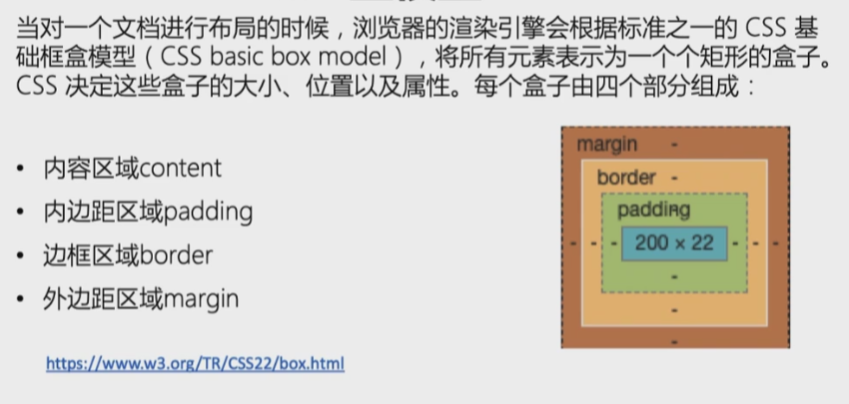
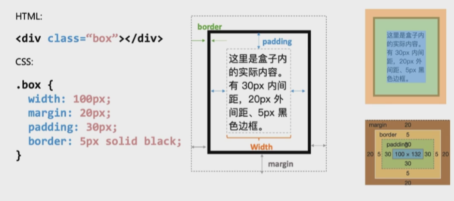
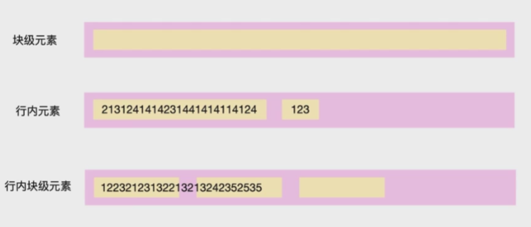
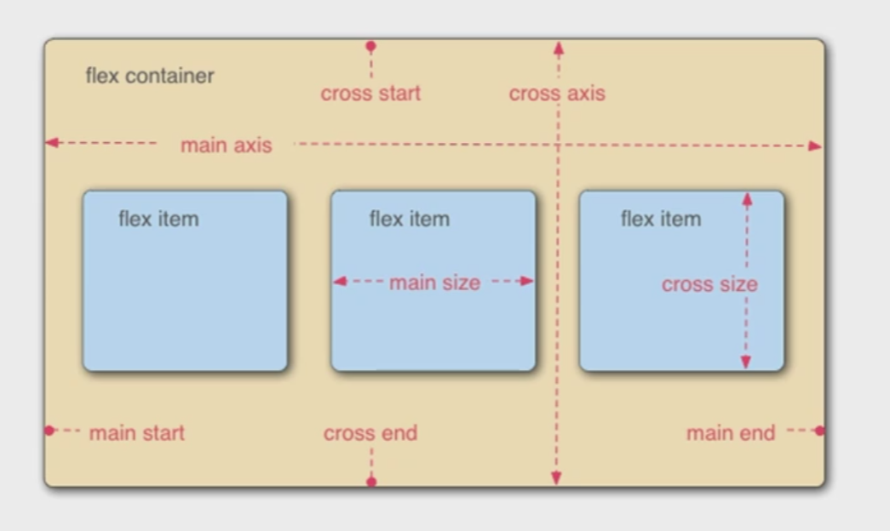

[TOC]

# HTML

### 基本标签

- **\<meta>**：设置编码方式
- **\<br/> **：换行
- **\<p>**：段落标签
- **\** ：图片标签
  - src属性表示图片文件路径
  - width和height表示图片尺寸
  - alt表示文件提示
- **\<h1>~\<h6>**：标题标签
- 列表标签：
  - **\<ol>**：有序列表
    - start：表示从*开始
    - type：显示类型 A a I i 1(default)
  - **\<ul>**：无序列表
    - type：disc(default)，circle，square
  - **\<li>**：列表项
- **\<b>**加粗，**\<i>**斜体，**\<u>**下划线
- **\<strong>**加粗，**\<em>**斜体
- **\<sub>**下标，**\<sup>**上标
- 部分字符实体：
  小于：\&lt;
  大于：\&gt;
  小于等于：\&le;
  大于等于：\&ge;
- **\<span>**：不换行的块标记
- **\<a>**：超链接
  - href：链接地址
  - **targrt**：\_self(default)本窗口打开，\_blank新窗口打开，\_parent在父窗口打开，\_top在顶层窗口打开
- **\<div>**：层

### table标签

- **table**：表格
  **tr：**行
  **td：**列
  **th**：表头列
- tr中有一个属性：
  - **align**对齐方式：center，left(default)，right
- td中有两个属性：
  - **rowspan**：行合并
  - **colspan**：列合并

### 表单标签

- 表单：**form**
  - **action**：发送到的目标文件
  - method：get、post······
- **\<input>**标签：
  - type属性：
    - **"text"**表示**文本框**
    - **"password"**表示**密码框**
    - **"radio"**表示**单选按钮**
      - **name属性值保持一致**，这样才会有互斥的效果
    - **"checkbox"**表示**复选框**
      - **name属性值建议保持一致**，这样将来我们服务器端获取的是一个数组
    - **"submit"提交**
    - **"reset"重置**
    - **"button"普通按钮**
    - **"file" 让用户选择文件的控件**
    - **"range"控制范围**
  - name属性：
    - 必须指定，否则文本框的数据是不会发送给服务器的
  - value：值
- **\<select>**表示下拉列表，选项为**\<option>**
  - name属性
  - value：发送给服务器的值
  - selected表示默认选中的项
- **\<textarea>**表示多行文本框(文本域)
  - name
  - rows：元素的输入文本的行数(显示的高度)
  - cols：文本域的可视宽度

- 属性名和属性值相同时，属性值可省略
  checked="checked"   <==>  checked

# CSS

### CSS选择器

- 类型、类和ID选择器

```css
/*类型(标签)*/
p {
    ...
}

/*类*/
.paragraph {
    ...
}

/*ID*/
#para {
    ...
}
```

```html
<p>类型选择器</p>
<p class = "paragraph">类选择器</p>  //可以有多个类,用空格隔开
<p id = "para">ID选择器</p>

//优先级：ID > 类 > 类型
```

- 属性选择器

```css
img[src] {
    ...
}
/*只会在有src属性的img标签上生效*/
```

```html

```

- 伪类与伪元素

```css
a:hover {
    ...
}
/*hover:鼠标移到标签上会触发*/
```

```html
<a href = "xx"></a>
```

- 后代选择器

```css
div span {
    ...
}
/*div标签下的span会生效*/
```

```html
<div>
    <span>Span 1
    	<span>Span 2</span>
    </span>
</div>
<span>Span 3</span>

/*只有1，2会生效*/
```

### CSS样式

```css
p {
    /*辅助框线样式*/
    width: 200px;
    height: 50px;
    border: 1px solid seagreen;
    /*文字格式*/
    text-align: center;
    /*设置行间距*/
    line-height: 50px;
    /*字母间距*/
    letter-spacing: 2px;
    /*单词间距*/
    word-spacing: 10px;
    /*文字颜色*/
    color: red;
    font-size: 20px;
    /*无衬线字体*/
    font-family: serif;
}

.ellipse {
    width: 100px;
    /*和normal一样, 连续的空白符会被合并*/
    white-space: nowrap;

    overflow: hidden;
    text-overflow: ellipsis;
}

.trans {
    width: 100px;
    height: 100px;
    background: red;
    transition: width 2s;
    /*X轴偏移量,Y轴偏移量,模糊半径,扩散半径和颜色*/
    box-shadow: 10px 10px 5px gray;
}

.trans:hover {
    width: 300px;
}

.rotate {
    width: 200px;
    height: 100px;
    background-color: yellow;
    transform: rotate(7deg);
}

.box {
    width: 100px;
    height: 100px;

    border: 5px solid green;
    border-bottom: 3px dotted orangered;

    border-radius: 20px;
    
    /*padding: 25px;*/
    /*padding: 30px 50px;*/
    padding: 10px 20px 30px 50px;

    /*margin: 25px;*/
    /*margin: 30px 50px;*/
    margin: 10px 20px 30px 50px;
}

.circle {
    width: 100px;
    height: 100px;
    border: 2px solid green;
    border-radius: 50%;
}

ul {
    /*设置列表元素的marker*/
    list-style-type: none;
    display: flex;
}

li a {
    /*用于设置文本的修饰线外观的*/
    text-decoration: none;
    margin: 10px;
}

.loading {
    width: 35px;
    height: 35px;
    border: 5px solid lemonchiffon;
    border-left-color: #FF9500;
    border-top-color: #FF9500;
    border-radius: 50%;
    animation: rotate 500ms infinite linear;
}
/*同故宫在动画序列中定义关键帧的样式来控制CSS动画序列中*/
@keyframes rotate {
    from {
        transform: rotate(0);
    }
    to {
        transform: rotate(1turn);
    }
}
```

```html
case 1 : 文本样式
<p>this is text</p>
case 2 : 处理溢出文本
<p class="ellipse">我要溢出啦</p>
case 3 : 简单动画
<div class="trans">动画</div>
case 3.1 : 旋转
<div class="rotate">旋转</div>
case 4 : 布局元素
<div class="box">box</div>
case 5 : border属性的其他用法 -> 绘制圆
<div class="circle"></div>
case 6 : 实现导航栏
<ul>
    <li><a href="xx">主页</a></li>
    <li><a href="xx">课程</a></li>
    <li><a href="xx">其他</a></li>
</ul>
case 7 : loading动画
<div class="loading"></div>
```

### 盒子模型





# WEB布局

### CSS 常用布局

- 什么是布局
  - 尺寸
  - 定位
- 普通文档流
  - 从左到右
  - 从上到下
- 块级元素、行内元素
  - 可以通过display属性改变(block，inline，inlineblock)



### CSS flex布局

- 什么是flex
  - flex是flexbox的缩写，意为弹性布局
  - 一维的布局模型
  - 任何一个容器都可以指定为flex布局
- Flex容器



- Flex容器上的属性
  - flex-direction：控制容器内元素的摆放，有4种方式
    - 水平从左向右：row
    - 水平从右向左：row-reverse
    - 垂直从上到下：column
    - 垂直从下到上：column-reverse
  - flex-wrap：可以实现换行效果
  - flex-flow：上面二者的简写
- Flex元素上的属性
  - flex-basis：控制元素在主轴上所占大小，没有指定会使用width作为最小值
  - flex-grow：规定了 `flex-grow` 项在 flex 容器中分配剩余空间的相对比例
  - flex-shrink：指定了 flex 元素的收缩规则。flex 元素仅在默认宽度之和大于容器的时候才会发生收缩，其收缩的大小是依据 flex-shrink 的值。默认为1，按比例计算
  - flex：上面三者的简写
- 元素的对齐
  - align-items
  - justify-content
- 为什么使用flex
  - 在元素外部处理空间分布
  - 让元素自己处理空间分布

### CSS定位

- 定位
  - 定位能够把一个元素从它原本在正常布局流中应该在的位置移动到另一个位置
  - position：
    - static 静态定位，默认
    - relative 相对定位
    - absolute 绝对定位，往上级节点寻找，直到position不为static，相对于该节点进行偏移
    - fixed 固定定位，相对于浏览器可视窗口进行偏移
    - sticky 粘性定位
- 浮动
  - 把一个元素“浮动”起来，会改变该元素本身和在正常布局流中跟随它的其他元素的行为
  - 这一元素会浮动到左侧或右侧，并且从正常布局流中移除，这时候其他的周围内容就会在这个浮动元素的周围环绕
  - float
  - clear：清除浮动

### 综合布局

### 响应式布局

- 响应式设计
- 响应式之前
- 如何实现响应式